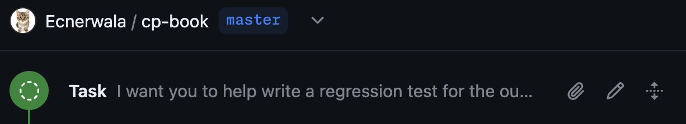

# Ad-hoc Tasks

An ad-hoc task is a task that you define yourself, without the context of an issue or pull request. You can start an ad-hoc task from the Copilot Workspace dashboard, or from the repository page on GitHub.com.

 *Start an ad-hoc task in Copilot Workspace*

Once started an ad-hoc task looks like this:

 *The timeline starts with the ad-hoc task and has no associated metadata*
