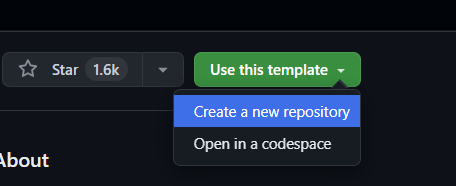

# Creating Repositories from Templates

Copilot Workspace allows you to create repositories from templates using natural langauge.

To get started with this feature, you can create a repository from a template by clicking the "New session" button in the [Copilot Workspace dashboard](https://copilot-workspace.githubnext.com), and search for a template. This will open a new task in the workspace where you can describe the software you want to create. Copilot will then generate a repository based on the description you provide. You can also navigate to a template repository and choosing "Use this template", like this:

 *Creating a repository from a template via Copilot Workspace*

The task is based on the description of the software to create, plus the README of the template repo. You can also start this kind of task by creating a . Once started a create repository task looks like this:

 *The task is labeled as “Repository”, and the “Template” panel indicates the template repo*

