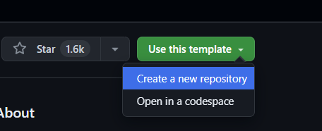
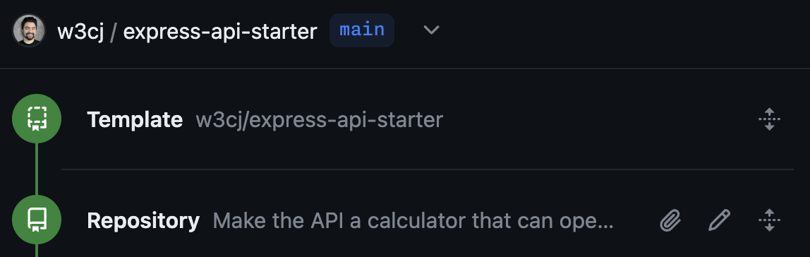
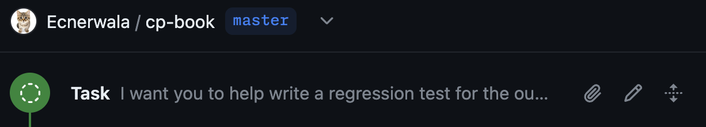

# Further Techniques

## Creating Repositories from Templates

 *Creating a repository from a template via Copilot Workspace*

The task is based on the description of the software to create, plus the README of the template repo. You can also start this kind of task by creating a [New Session in Copilot Workspace](https://copilot-workspace.githubnext.com/new). Once started a create repository task looks like this:

 *The task is labeled as “Repository”, and the “Template” panel indicates the template repo*

## Refining Pull Requests

 *Refine a pull request in Copilot Workspace*

Here you give a task description explicitly, and the task takes into account the specific code changes in the PR. Once started a pull request task looks like this:

 *A “Pull Request” panel includes the title and description of the PR, along with the task*

## Ad-hoc Tasks

An ad-hoc task is a task that you define yourself, without the context of an issue or pull request. You can start an ad-hoc task from the Copilot Workspace dashboard, or from the repository page on GitHub.com.

 *Start an ad-hoc task in Copilot Workspace*

Once started an ad-hoc task looks like this:

 *The timeline starts with the ad-hoc task and has no associated metadata*

## Separate Repos for Issues and Code

<!-- TODO(eaftan): fill this in -->

Some teams use separate repositories for issues and code. If you're working in a repository that's different from the one where the issue was filed, you can still use Copilot Workspace. TODO.

## Copilot Workspace for Repo Maintainers

see docs

## Incoming Links

see docs

## Troubleshooting

see docs

