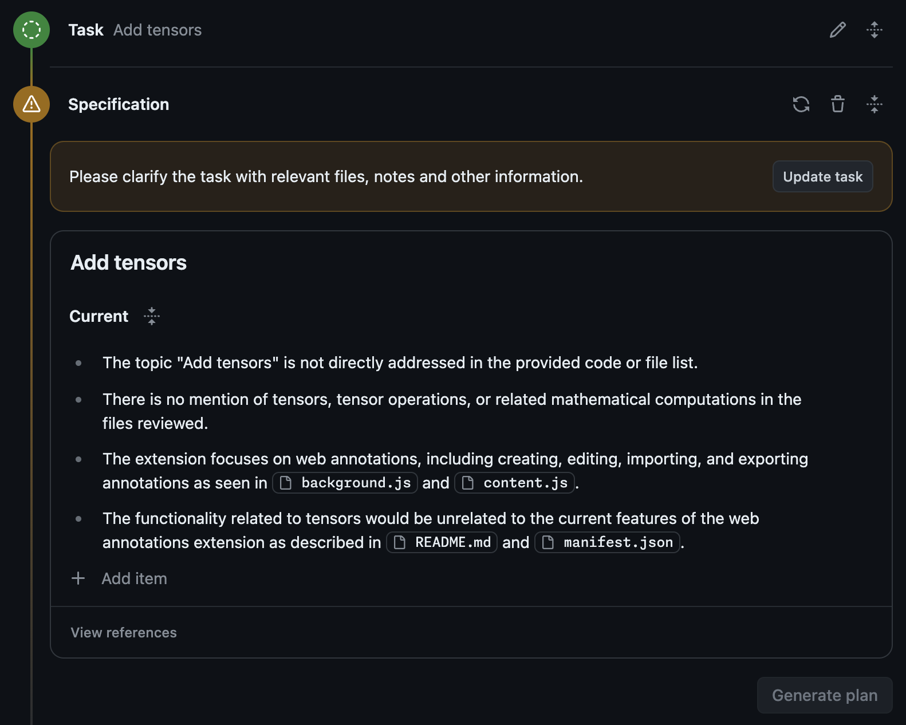

# Further Techniques

## Separate Repos for Issues and Code

<!-- TODO(eaftan): fill this in -->

Some teams use separate repositories for issues and code. If you're working in a repository that's different from the one where the issue was filed, you can still use Copilot Workspace. TODO.

## Ambiguity Warnings

If Copilot Workspace detects that your task is overly ambiguous/unclear (e.g. it doesn’t seem aligned with the goals/focus of the repo), then it warn you about that and ask you to clarify the task further, before you can carry on. This is done to prevent hallucination in the plan and help guide you towards the “pit of success”, since subsequent stages of the workflow work best with sufficient detail.

*A warning that a task is too ambiguous and that their intent needs to be clarified*

## Copilot Workspace for Repo Maintainers

see docs

## Incoming Links

see docs

## Troubleshooting

see docs

