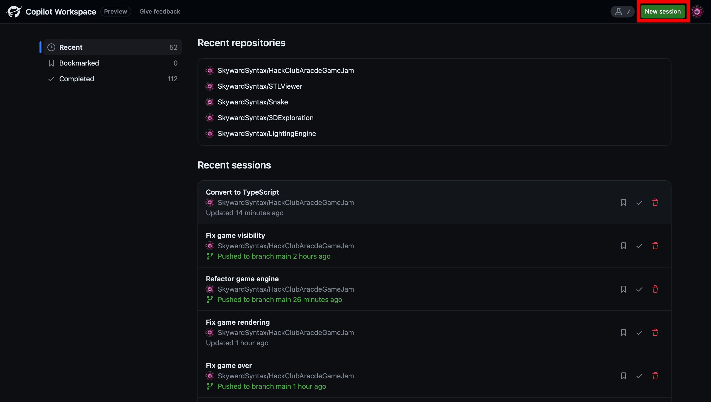
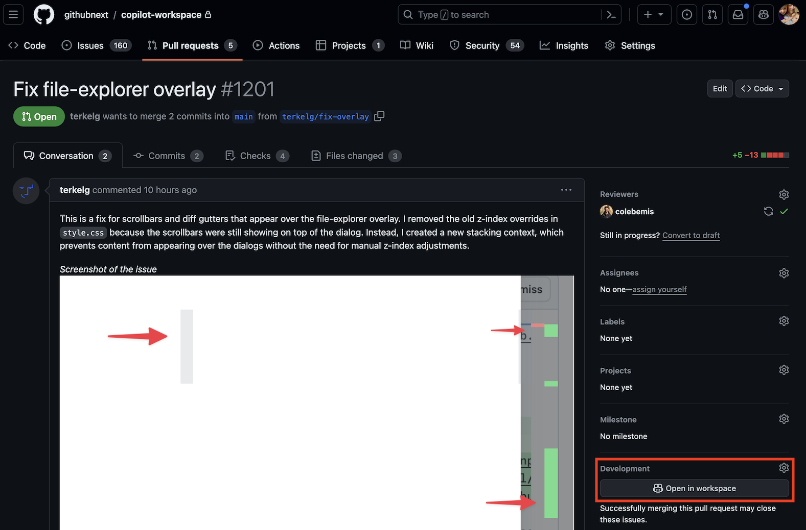

# Getting Started with Copilot Workspace

Welcome to the technical preview for Copilot Workspace! 👋 In order to help you get started, here are a few potential things you can try out:

1. __Open an issue in a GitHub repo, and click the “Open in Workspace” button.__ This will start a new Copilot Workspace 
   session, pre-seeded with the issue as the task, and allow you to iterate on the spec/plan/implementation for it

   

1. __Open the integrated terminal__ in order to build/test/run your changes. You can do this by clicking the terminal icon
   in the header bar, or clicking the “Open terminal” button in the “Implementation” panel (after you’ve started 
   implementing a task).

1. __Share a session snapshot with someone__ by clicking the share button in the upper-right section of the header bar, and sending them the URL. Note that anyone with access to the repository can view a read-only version of the snapshot. But if you send a link to someone else in the preview, they'll be able to fork your session, in order to explore it further. 

1. __Install the GitHub mobile app__ on your phone and open an issue from there by clicking the “...” menu and selecting 
   “Open in Workspace”. Note that the mobile web client for Copilot Workspace is optimized for mobile usage. And since your 
   sessions/edits are automatically saved, you can start a task on your phone and resume it on your desktop.

1. Visit the [Copilot Workspace dashboard](https://copilot-workspace.githubnext.com) and __start a new session__ by 
   clicking the “New Session” button. This will allow you to search for a repo and then define an ad-hoc task for it. 
   Effectively like a draft issue. And if you select a [template repo](https://docs.github.com/en/repositories/creating-and-managing-repositories/creating-a-template-repository), you can define the requirements of a new repo that 
   you create from that.

   

1. __Iterate on a pull request__ by clicking the “Open in Workspace” button, defining the change you’d like to make (e.g. 
   “Add docs for the changes in the PR”) and then implementing them.

   

1. __Open a workspace session in a Codespace,__ by clicking the “Open in Codespace” button in the header bar or in the 
   “Implementation” panel. Note that your workspace edits will be synced to the Codespace, and also, any edits you make in 
   the Codespace are synced back to the workspace. This allows you to use VS Code/Codespaces as a companion experience for 
   making larger edits, debugging, etc.

1. __Learn about ad-hoc tasks__ by visiting the [Ad-hoc Tasks](adhoc-tasks.md) page. Ad-hoc tasks are tasks that you define yourself, without the context of an issue or pull request. You can start an ad-hoc task from the Copilot Workspace dashboard, or from the repository page on GitHub.com.
