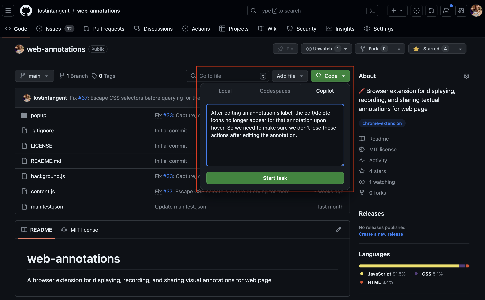

# Compiti Ad-Hoc

Un compito ad-hoc è un compito che definisci tu stesso, senza il contesto di un problema o di una pull request. Puoi avviare un compito ad-hoc dal dashboard di Copilot Workspace, o dalla pagina del repository su GitHub.com.

 *Avvia un compito ad-hoc in Copilot Workspace*

Una volta avviato, un compito ad-hoc appare così:

 *La timeline inizia con il compito ad-hoc e non ha metadati associati*

Dopo la creazione, i compiti ad-hoc procedono come i compiti per i problemi.
