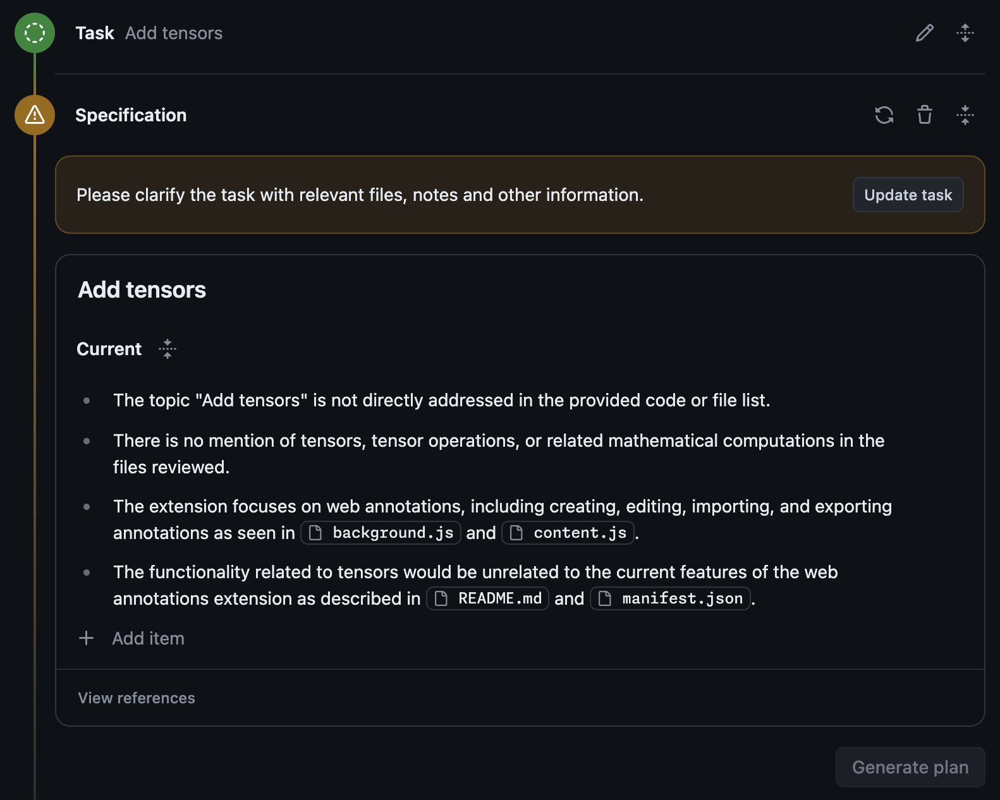

# Tecniche Avanzate

## Repository Separati per Problemi e Codice

Alcuni team utilizzano repository separati per problemi e codice. Consulta "suggerimenti e trucchi".

## Avvisi di Ambiguità

Se Copilot Workspace rileva che il tuo compito è eccessivamente ambiguo/unclear (ad esempio, non sembra allineato agli obiettivi/focus del repository), potrebbe avvisarti in merito e chiederti di chiarire ulteriormente il compito prima di poter procedere. Questo viene fatto per evitare ambiguità nella specifica e aiutarti a raggiungere il "pozzo del successo", poiché le fasi successive del flusso di lavoro funzionano meglio con dettagli sufficienti.



*Un avviso che un compito è troppo ambiguo e che la tua intenzione deve essere chiarita*

## Collegamenti in Arrivo

Copilot Workspace ha la capacità di specificare il compito tramite parametri di query quando il soggetto è un repository, un branch o una pull request.

```
https://copilot-workspace.githubnext.com/githubnext/copilot-workspace/pull/695?task=Aggiungere%20ulteriori%20test%20unitari%20a%20questa%20pull%20request.```
```

I parametri di query supportati sono

- `task` - La descrizione del compito. Se non specificato e il soggetto è un problema, viene utilizzato il corpo del problema, altrimenti non viene utilizzato alcun corpo del compito e l'utente deve inserirne uno.
- `codeOwner` - L'organizzazione o l'individuo per il repository di codice associato a un problema, ad esempio `githubnext` per `githubnext/copilot-workspace`
- `codeRepo` - Il nome del repository di codice associato a un problema, ad esempio `copilot-workspace` per `githubnext/copilot-workspace`
- `branch` - Lo SHA o il nome del branch per analizzare il compito, ad esempio `main`
