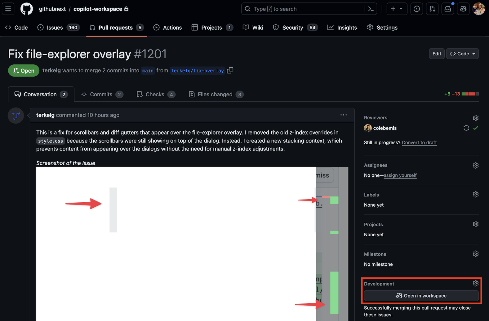

# Guida introduttiva a Copilot Workspace

Benvenuto alla versione di anteprima tecnica di Copilot Workspace! 👋 Per aiutarti a iniziare, ecco alcune cose che potresti provare:

1. __Apri un problema in un repository GitHub e clicca il pulsante “Apri in Workspace”.__ Questo avvierà una nuova sessione di Copilot Workspace, pre-caricata con il problema come compito, e ti permetterà di lavorare sulla specifica/pianificazione/realizzazione per esso.

   

1. __Apri il terminale integrato__ per costruire/testare/eseguire le tue modifiche. Puoi farlo cliccando sull'icona del terminale nella barra degli strumenti, o cliccando il pulsante “Apri terminale” nel pannello “Implementazione” (dopo aver iniziato a implementare un compito).

1. __Condividi uno snapshot della sessione con qualcuno__ cliccando sul pulsante di condivisione nella sezione in alto a destra della barra degli strumenti, e inviando loro l'URL. Nota che chiunque abbia accesso al repository può visualizzare una versione in sola lettura dello snapshot. Ma se invii un link a qualcun altro nella versione di anteprima, potranno fare il fork della tua sessione per esplorarla ulteriormente.

1. __Installa l'app mobile di GitHub__ sul tuo telefono e apri un problema da lì cliccando sul menu “...” e selezionando “Apri in Workspace”. Nota che il client web mobile di Copilot Workspace è ottimizzato per l'uso su dispositivi mobili. E poiché le tue sessioni/modifiche vengono salvate automaticamente, puoi iniziare un compito sul tuo telefono e riprenderlo sul desktop.

1. Visita il [dashboard di Copilot Workspace](https://copilot-workspace.githubnext.com) e __avvia una nuova sessione__ cliccando il pulsante “Nuova sessione”. Questo ti permetterà di cercare un repository e poi definire un compito ad hoc per esso. Effettivamente come un problema in bozza. E se selezioni un [repository modello](https://docs.github.com/en/repositories/creating-and-managing-repositories/creating-a-template-repository), puoi definire i requisiti di un nuovo repository che crei da quello.

   

1. __Lavora su una pull request__ cliccando il pulsante “Apri in Workspace”, definendo la modifica che desideri apportare (ad es. “Aggiungi documentazione per le modifiche nella PR”) e poi implementandola.

   

1. __Apri una sessione di workspace in un Codespace,__ cliccando il pulsante “Apri in Codespace” nella barra degli strumenti o nel pannello “Implementazione”. Nota che le modifiche al tuo workspace saranno sincronizzate con il Codespace, e inoltre, qualsiasi modifica apportata nel Codespace sarà sincronizzata di nuovo nel workspace. Questo ti permette di utilizzare VS Code/Codespaces come esperienza complementare per apportare modifiche più ampie, fare debug, ecc.
