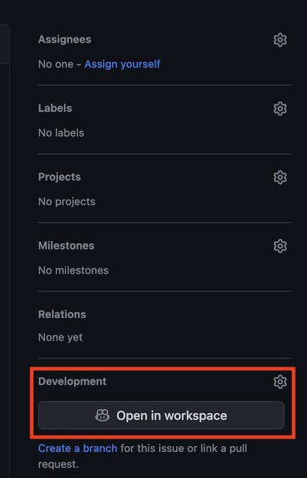
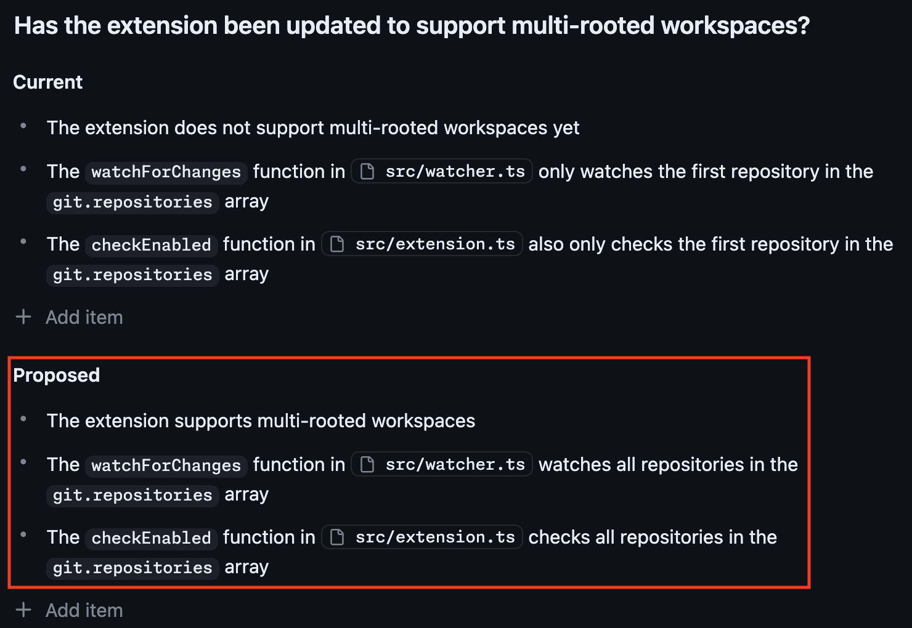
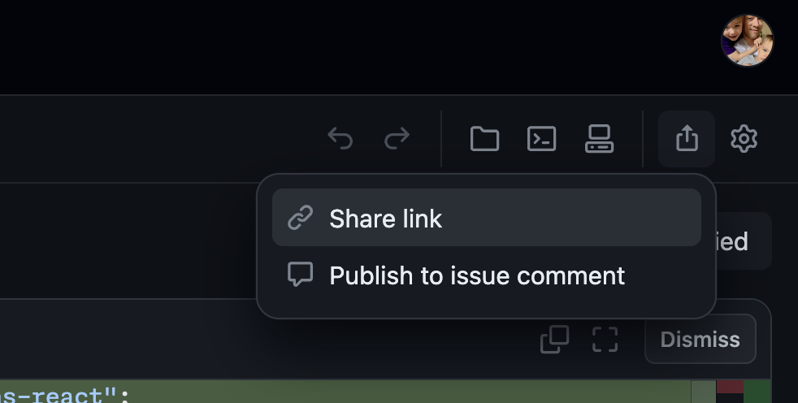
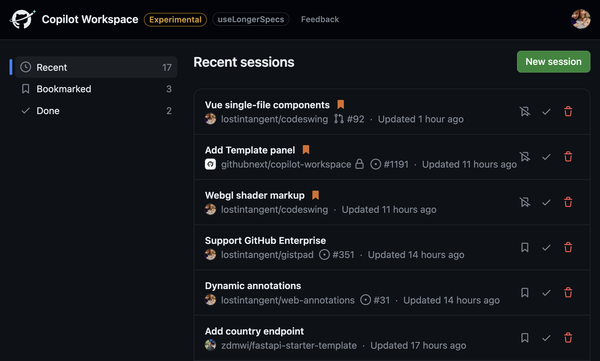

# Copilot Workspace: Panoramica

Il [Copilot Workspace](https://githubnext.com/projects/copilot-workspace/) è un assistente AI _centrato sulle attività_. Ogni giorno, come sviluppatore, inizi con un compito e intraprendi il viaggio per esplorare, capire, perfezionare e completare quel compito, un viaggio che può essere emozionante, stimolante, affascinante e gratificante. Il Copilot Workspace fa questo viaggio con te, passo dopo passo — il viaggio dal compito al codice funzionante.

Il Copilot Workspace si basa su un insieme di principi che guidano il suo design e lo sviluppo:

* Il Copilot Workspace è _contestuale_. È profondamente integrato con GitHub ed è consapevole del contesto del tuo compito — il repository, l'issue, la pull request.

* Il Copilot Workspace è _assistente_. Offre una tela per navigare tra compiti sconosciuti, arricchendo le tue competenze di sviluppo con un nuovo tipo di assistenza AI.

* Il Copilot Workspace è _onnipresente_. È pronto e disponibile per te, disponibile su ogni issue in ogni repository abilitato su GitHub. E il Copilot Workspace è lì anche per te quando inizi a scrivere nuovo codice, disponibile su ogni repository modello, per creare nuovo software utilizzando il linguaggio naturale.

* Il Copilot Workspace è _iterativo_. Il Copilot Workspace ti incoraggia a controllare, rivedere, perfezionare e iterare sugli output generati dall'AI. Tu, lo sviluppatore, sei al comando.

* Il Copilot Workspace è _collaborativo_. Puoi condividere sessioni con il tuo team e pubblicare link alle tue sessioni su issue e pull requests. E, se sei un responsabile del repository, ti offriamo controlli per aiutarti a gestire l'uso dello sviluppo assistito dall'AI nei tuoi repository.

* Il Copilot Workspace è _configurabile_. Puoi integrare il Copilot Workspace nei tuoi flussi di lavoro tramite collegamenti profondi al Copilot Workspace che specificano compiti comuni.

In questo manuale, ti guideremo attraverso i concetti e le funzionalità del Copilot Workspace e ti aiuteremo a iniziare ad usarlo in modo efficace.

*Una sessione di workspace completamente implementata*

## Funzionalità

1. [Compito](#compito)
1. [Specificazione](#specificazione)
1. [Piano](#piano)
1. [Implementazione](#implementazione)
1. [Iterazione sui File](#iterazione-sui-file)
1. [Terminale Integrato](#terminale-integrato)
1. [Condivisione della Sessione](#condivisione-della-sessione)
1. [Completamento del Compito](#completamento-del-compito)
1. [Dashboard della Sessione](#dashboard-della-sessione)

## Compito

Tutto nel Copilot Workspace inizia con un "compito", che è una descrizione in linguaggio naturale dell'intento. Il compito ha sempre un contesto: un repository GitHub.
Per questa anteprima tecnica, il Copilot Workspace supporta quattro tipi di compiti: risolvere issue, [perfezionare pull requests](pull-request-tasks.md), [creare repository da modelli](creating-repos.md) e [compiti ad hoc](adhoc-tasks.md). Qui ci concentriamo sulla risoluzione delle issue, che è il punto di ingresso più comune.

Una volta iscritto all'anteprima tecnica, su ogni issue su GitHub troverai un nuovo pulsante "Apri in Workspace":

*Apri un'issue nel Copilot Workspace*

Questo aprirà il Copilot Workspace contestualizzato su questa issue. Per i compiti delle issue, il compito si basa sul titolo e sul corpo dell'issue, oltre al thread dei commenti dell'issue. Il Copilot Workspace passerà immediatamente al passo successivo nella timeline. Questo si presenta così:

*Il compito è etichettato come "Issue" e l'analisi inizia*

## Specificazione

Per aiutare a riassumere una definizione di compito non banale (ad esempio un'issue con un lungo thread di commenti), il Copilot Workspace genera prima un "argomento" per il compito, che assume la forma di una domanda che può essere posta al codice sorgente e utilizzata per definire i criteri di successo prima/dopo (vedi la sezione [specificazione](#specificazione) qui sotto).

*Nota come l'argomento introduca chiarezza completamente assente nel titolo dell'issue*

Puoi pensare all'argomento come un modo per sintetizzare il compito alla sua essenza e per darti un'opportunità precoce e veloce per vedere se il Copilot Workspace è sulla giusta strada. Se l'argomento è sbagliato, non è necessario continuare. Ma se l'argomento è corretto, ti aiuta a capire meglio il compito e a concentrarti sugli aspetti più importanti del codice sorgente rilevanti per il compito.

Dopo aver prodotto l'argomento, il Copilot Workspace genera un elenco puntato che descrive il comportamento attuale del codice sorgente, basato sul compito e sull'argomento proposto. Questo aiuta a costruire la tua fiducia che il Copilot Workspace sia sulla giusta strada e serve come mezzo di integrazione al contesto, nei casi in cui potresti non comprendere appieno lo stato attuale.

*La specificazione attuale risponde alla domanda nell'argomento basandosi sullo stato attuale*

E se il Copilot Workspace commette errori, puoi facilmente modificare/eliminare passaggi dalla specifica attuale o addirittura scegliere di rigenerare completamente una nuova specifica ("riprova"). In pratica, tendiamo a ottenere risultati abbastanza buoni al primo tentativo.

Dopo la specifica attuale, il Copilot Workspace genera una "specificazione proposta", che è un elenco puntato che articola lo stato in cui si troverebbe il codice sorgente dopo aver risolto il compito (rispondendo efficacemente alla domanda nell'argomento). E in particolare, la specificazione proposta si concentra sulla definizione dei criteri di successo del compito, anziché entrare nei dettagli implementativi (che è il ruolo del [piano](#piano)).

*La specificazione proposta indica come modificare il codice sorgente per risolvere il compito*

## Selezione dei Contenuti

Per generare le specifiche attuali e proposte e per tutti i passaggi successivi, il Copilot Workspace deve identificare quali file nel codice sorgente sono rilevanti per comprendere e completare il compito. Lo fa attraverso una combinazione di tecniche LLM e ricerca tradizionale del codice. I contenuti dei file più rilevanti vengono quindi utilizzati come contesto per quasi tutti i passaggi nel flusso di lavoro.

Gli utenti possono esaminare i file selezionati dal Copilot Workspace utilizzando il pulsante "Visualizza riferimenti" nel pannello Specifica. Per regolare quali file sono selezionati, gli utenti possono modificare il compito e utilizzare il linguaggio naturale per specificare quali file sono rilevanti.

*I riferimenti che il modello ha utilizzato per generare le specifiche originali e modificate*

## Piano

Una volta soddisfatto delle specifiche attuali e proposte, puoi richiedere al Copilot Workspace di generare un piano, che è un elenco dei file che devono essere modificati (ad esempio, modificati, creati, eliminati, spostati o rinominati) per completare i criteri di successo della specifica proposta. Inoltre, ogni file modificato include un elenco di passaggi specifici che indicano le modifiche esatte che devono essere apportate.

Come la specifica, il piano è completamente modificabile e rigenerabile, il che ti consente di perfezionare e guidare il Copilot Workspace nella giusta direzione.

*Un piano, mostrando i passaggi necessari per modificare un file e aggiungerne un secondo*

## Implementazione

Quando sei soddisfatto del piano, puoi fare clic sul pulsante "Implementa" per iniziare l'implementazione. Questo aggiornerà l'interfaccia utente per mostrare una serie di aggiornamenti dei file in coda sul lato destro e quindi inizierà a generare i contenuti dei file aggiornati uno per uno. Quando un file inizia a generare, il suo ingresso associato nel piano verrà mostrato come in corso. E quando è completato, il piano lo indicherà come fatto.

Una volta implementato un file, il Copilot Workspace renderà una vista diff per esso e scorrerà automaticamente alla prima modifica. Gli editor diff sono modificabili, il che consente di apportare piccole modifiche direttamente al codice, anziché iterare tramite modifiche al compito, alla specifica o al piano.

## Iterazione sui File

Il Copilot Workspace non ottiene sempre tutto correttamente, quindi rende facile per gli utenti iterare sulle implementazioni file per file. Basta aggiungere, rimuovere, modificare gli elementi nei passaggi del piano per ciascun file, selezionare la casella di controllo e fare clic sul pulsante "Aggiorna i file selezionati". Questo rigenererà i contenuti dei file selezionati e aggiornerà la vista diff.

Ad esempio, puoi modificare direttamente il diff o puoi tornare al piano e apportare modifiche lì. E se devi apportare modifiche più estese, puoi rigenerare completamente il piano.

*Il pannello del piano consente agli utenti di iterare sull'implementazione file per file*

## Terminale Integrato

Una volta implementato il piano, il Copilot Workspace ti consente di convalidare le modifiche per correttezza aprendo un terminale integrato ed eseguendo comandi shell. Questo consente di eseguire una build, lint, test, ecc. sulle modifiche ed è un modo rapido ed efficace per acquisire fiducia sul compito e sullo stato di completamento. Il terminale è supportato da un Codespace, quindi è un sandbox sicuro con un ambiente di sviluppo completo installato.

*Terminale integrato, mostrando il nome del branch generato e l'accesso al calcolo in tempo reale*

Se desideri apportare modifiche più estese o sfruttare le funzionalità avanzate dell'editor (ad esempio, il debug step by step), puoi aprire la sessione del Copilot Workspace in un Codespace, utilizzando uno qualsiasi dei client supportati da Codespace.

## Condivisione della Sessione

Per facilitare la condivisione di una sessione di workspace con altri (ad esempio, per fare una revisione del codice ad hoc o condividere un'idea di implementazione iniziale), il Copilot Workspace consente agli utenti di generare link condivisi. Questi link possono essere condivisi con ospiti, anche se non fanno parte dell'anteprima del Copilot Workspace.

Le sessioni condivise sono copie della sessione originale. Gli utenti non ospiti possono utilizzarle come punto di partenza per continuare il compito o esplorare soluzioni alternative senza interferire con la sessione originale. Gli utenti ospiti possono visualizzare la sessione ma non possono utilizzare il workspace per apportare modifiche.

*Generazione di un link condiviso dalla barra dell'intestazione*

Lavorando con issue e pull requests, puoi anche

* Pubblicare un commento sull'issue. Il Copilot Workspace genera automaticamente un commento con un link condiviso per la sessione, che viene incluso nell'issue. Questo consente ai revisori di accedere rapidamente alla sessione del workspace e vedere le modifiche proposte.

* Pubblicare un commento sulla pull request. Simile al commento sull'issue, il Copilot Workspace genera automaticamente un commento con un link condiviso per la sessione, che viene incluso nella pull request. Questo consente ai revisori di accedere rapidamente alla sessione del workspace e vedere le modifiche proposte.

## Completamento del Compito

Quando un compito è implementato, convalidato e revisionato, puoi completare il compito in modi diversi, a seconda del tipo di compito su cui stai lavorando.

*Creazione di una pull request per le modifiche implementate*

| Tipo di compito | Completamenti disponibili | 
|-----------------| ------------------------- |
| Issue | — Creare una pull request   — Creare una pull request in bozza   — Eseguire il push su un nuovo branch   — Eseguire il push delle modifiche sul branch corrente (disponibile solo se hai i permessi di commit sul repo)     Questi possono creare un fork del repository se non hai accesso in scrittura |
| Compito ad hoc | — *Come per le issue* |
| Compito PR | — Aggiornare la pull request (effettua un nuovo commit con le modifiche)   — *Come per le issue* |
| Compito del repository | — Creare un repository (crea un nuovo repo dal repo modello selezionato e include le modifiche) |

## Dashboard della Sessione

Il Copilot Workspace salva automaticamente il tuo lavoro. Fornisce anche una dashboard della sessione, che ti consente di riprendere facilmente il lavoro in seguito. Puoi iniziare un compito dal tuo telefono e poi completarlo sul tuo laptop, o viceversa.

*La dashboard del Copilot Workspace mostra le sessioni recenti, contrassegnate e completate*

Sono supportati annulla e ripeti all'interno della sessione tramite pulsanti sulla barra degli strumenti.

## Appendice: Glossario

| Termine | Definizione |
|---------|------------|
| Copilot Workspace | Un ambiente di sviluppo nativo di Copilot progettato per esplorare e completare compiti quotidiani |
| Target | Un branch di un codice sorgente in un commit specifico | 
| Compito | Una descrizione in linguaggio naturale di una modifica a un target | 
| Argomento | Un breve riassunto di una frase di un compito, di solito in forma di domanda |
| Specificazione | Una descrizione dello stato attuale e proposto del target in relazione al compito |
| Piano | Un elenco di file da aggiungere, rimuovere o modificare, con note su ciascuno di essi, che insieme trasformano il target dallo stato attuale a quello proposto |
| Implementazione | Un insieme di modifiche al target che, quando applicate, completeranno il compito |
| Sessione | Il progresso salvato di un utente verso il completamento di un compito, un singolo compito può avere molte sessioni |
| Sessione snapshot | Uno snapshot della sessione di un utente, creato quando si fa clic su "Condividi link", includendo sia il progresso del compito che lo stato UX |
