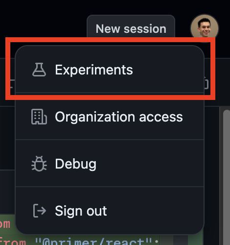
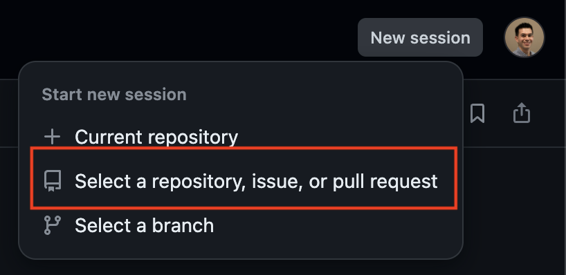
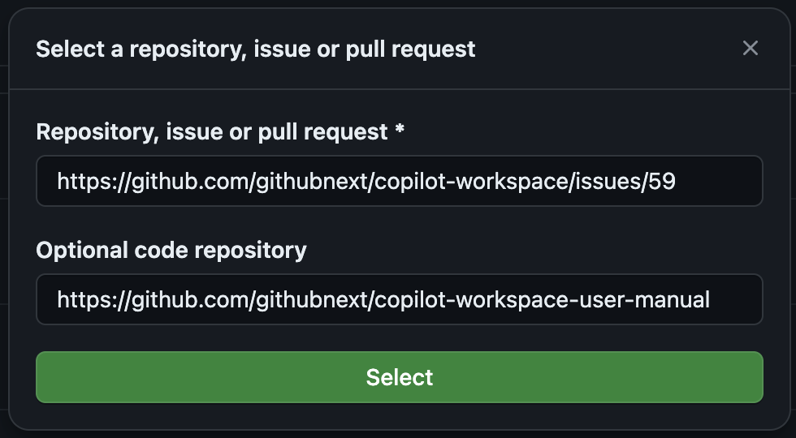

# Consigli e Trucchi

Questo documento contiene vari consigli e trucchi per utilizzare efficacemente Copilot Workspace. Ci piacerebbe conoscere anche i tuoi consigli e trucchi! Per favore condividili con noi nei [canali di feedback](README.md#feedback).

## Modifica l'Issue o il Task

✨ CONSIGLIO: Puoi modificare l'issue o il task per guidare Copilot Workspace.

Il pannello Issue/Task potrebbe essere precompilato con contenuti a seconda di come hai inserito Copilot Workspace. Ad esempio, se hai iniziato da un Issue, il pannello Issue sarà precompilato con il contenuto dell'issue. Questo contenuto è effimero - le modifiche non vengono sincronizzate con l'issue - quindi sentiti libero di modificarlo per fornire più contesto o per indirizzare Copilot Workspace verso risultati migliori.

## I Task possono essere brevi!

✨ CONSIGLIO: Potresti sorprenderti dell'efficacia di task semplici come "Aggiungi test di unità"

I task non devono essere lunghi. Dichiarazioni semplici e chiare come "Passa a usare Python numpy" o "Aggiungi più test di unità per il codice del server" possono portarti lontano. Puoi facilmente aggiungere ulteriori chiarimenti e iterare.

## Chiarisci l'Issue o il Task

✨ CONSIGLIO: Poche parole di chiarimento possono fare una grande differenza!

Solo poche parole di chiarimento possono fare una grande differenza nella qualità dei risultati che ottieni. Ad esempio,

* _aggiungi test di unità corrispondenti in `test/server`_ o

* _il problema è nel codice di convoluzione_ o

* _non modificare alcun codice esistente, aggiungi solo test di unità_

sono esempi di chiarimenti utili. Usa quanti di questi vuoi!

## Considera di utilizzare Esempi

✨ CONSIGLIO: Dare esempi di ciò che desideri può essere un ottimo modo per chiarire un task

Ad esempio, puoi dire: _Ecco alcuni esempi di invocazioni da riga di comando che dovrebbero funzionare dopo la modifica..._ e dare alcuni esempi. Oppure puoi dire: _Ecco alcuni esempi dell'output atteso..._ e dare alcuni esempi.

## Controlla l'Argomento e le Specifiche

✨ CONSIGLIO: Controlla l'argomento e le specifiche - se sono corretti, allora Copilot Workspace è sulla strada giusta

L'Argomento è il tuo primo rapido sguardo all'analisi di Copilot Workspace del tuo task nel contesto del tuo repository, e la Specifica Corrente segue poco dopo, poi la Specifica Aggiornata. Se queste sono corrette, allora Copilot Workspace è sulla strada giusta. Se non lo sono, potresti dover fornire più contesto, chiarimenti e suggerimenti nel pannello Issue/Task, o potresti essere in procinto di eseguire qualcosa al di là delle attuali capacità di Copilot Workspace.

Puoi modificare tutte queste per correggerle, e controllarle rapidamente può farti risparmiare molto tempo. Puoi anche tornare indietro e chiarire l'issue o il task e riprovare.

## Controlla la Selezione dei Contenuti

✨ CONSIGLIO: Controlla la selezione dei contenuti e utilizza brevi note nell'issue o nel task per indicare dove guardare

Puoi [controllare la selezione dei contenuti utilizzata](overview.md#content-selection). Spesso la selezione dei contenuti può essere migliorata, e al momento puoi farlo attraverso il linguaggio naturale e le note nell'issue/task. Se sai dove si trova il codice che deve essere modificato, puoi dirlo nel pannello issue/task. Ad esempio, puoi dire: _Guarda in `src/server.js`_ o molte altre variazioni.

Per determinare come affrontare un task, Copilot Workspace deve determinare quali file in un repository sono rilevanti per il task. Questo è difficile, e Copilot Workspace potrebbe non sempre selezionare i file corretti. Se ciò accade, potresti ottenere risultati di bassa qualità.

Per rivedere i file selezionati, nel pannello Specifica, clicca sul pulsante "Visualizza riferimenti":

Per indirizzare Copilot Workspace verso una migliore selezione dei file, puoi menzionare nomi di file, nomi di directory, ecc. nel pannello issue/task. Scrivilo in modo naturale, come se stessi scrivendo un'issue normale.

## Se non hai successo al primo tentativo...

✨ CONSIGLIO: Prova a rigenerare la specifica o il piano

Se non sei soddisfatto dei risultati che stai ottenendo, puoi provare a rigenerare la specifica e/o il piano. Per farlo, clicca sul pulsante "Rigenera" nei pannelli Specifica o Piano:

## Iterare sull'Implementazione

✨ CONSIGLIO: Aggiungi brevi note ai file nel piano, quindi itera

Spesso Copilot Workspace otterrà un task *quasi corretto*, ma potrebbe avere problemi con alcune parti. In questo caso, puoi reimplementare file specifici con istruzioni nuove o aggiuntive. Dopo aver implementato e revisionato il codice, puoi selezionare file nel pannello Piano e aggiungere punti elenco, quindi fare clic su "Aggiorna file selezionati" per reimplementare quei file con le nuove istruzioni che hai fornito.

## Aggiungi Nuovi File e Itera

✨ CONSIGLIO: Puoi aggiungere nuovi file e iterare sull'implementazione

Se hai bisogno di aggiungere nuovi file all'implementazione, puoi farlo cliccando sul pulsante "Aggiungi file" nel pannello Piano. Questo aggiungerà un nuovo file al piano, che potrai quindi implementare e iterare.

## Considera la Generazione di Nuovi File

✨ CONSIGLIO: Generare nuovi file può essere meglio che aggiungere a file esistenti

Questa anteprima tecnica di Copilot Workspace utilizza la "riscrittura dell'intero file". Ciò significa che quando chiedi a Copilot Workspace di aggiungere codice a un file, sostituirà l'intero file con il nuovo codice. Quando si eseguono task come scrivere test di unità o generare documentazione o nuovo codice di implementazione, può essere più facile e veloce generare nuovi file, per poi rinominarli.

## Condividi Presto, Condividi Spesso

✨ CONSIGLIO: Puoi condividere la tua sessione in qualsiasi momento, anche con persone che non fanno parte dell'anteprima di Copilot Workspace.

Puoi condividere la tua sessione di Copilot Workspace con altri cliccando sul pulsante "Condividi" nell'angolo in alto a destra dello schermo. Questo genererà un link che potrai condividere con altri. Questi link possono essere condivisi con ospiti, anche se non fanno parte dell'anteprima di Copilot Workspace. Dovranno accedere con il loro account GitHub per visualizzare la sessione.

Le sessioni condivise sono copie della sessione originale. Gli utenti non ospiti possono usarle come punto di partenza per continuare il task o esplorare soluzioni alternative senza interferire con la sessione originale. Gli utenti ospiti possono visualizzare la sessione ma non possono utilizzare lo spazio di lavoro per apportare modifiche.

## Utilizza le Sessioni

✨ CONSIGLIO: Torna al tuo lavoro in qualsiasi momento

Le tue sessioni vengono salvate automaticamente, quindi non perderai il lavoro se chiudi il browser o ti sposti dalla pagina. Puoi tornare alla tua sessione andando al [dashboard di Copilot Workspace](https://copilot-workspace.githubnext.com).

## Configura il Terminale per il Tuo Repository

✨ CONSIGLIO: Configura un file `devcontainer.json` nel tuo repository per configurare il terminale

Forniamo un terminale integrato in modo che tu possa convalidare le modifiche al codice suggerite da Copilot Workspace. Utilizziamo GitHub Codespaces per fornire questo terminale e utilizziamo il file `devcontainer.json` nel tuo repository per configurare il container che alimenta il terminale. Se devi apportare modifiche al container predefinito per installare software necessario, ecc., puoi farlo creando un file `devcontainer.json` nel tuo repository. Scopri di più sui Contenitori di Sviluppo su https://containers.dev/.

## Utilizza il Codespace

✨ CONSIGLIO: La modifica completa nel Codespace è semplice e veloce

I file modificati sono sincronizzati in entrambe le direzioni tra Copilot Workspace e il terminale/Codespace. Sentiti libero di modificare in uno qualsiasi dei due luoghi, e le tue modifiche saranno riflesse nell'altro.

Consulta la [Guida ai Codespaces](./codespaces-guide.md) per ulteriori informazioni.

## Esplora gli Esperimenti!

✨ CONSIGLIO: Esplora i nostri esperimenti e inviaci feedback!

Stiamo sempre provando cose nuove in Copilot Workspace. Puoi partecipare ai nostri esperimenti attuali cliccando sul tuo avatar nell'angolo in alto a destra dello schermo e selezionando "Esperimenti":

## Lavora Intorno alla "Pigrizia" del Modello

✨ CONSIGLIO: Se il modello è "pigro" e omette parti di file modificati, copia e incolla le parti mancanti dalla differenza

A volte il modello sarà "pigro" e ometterà parti di file modificati. Se vedi che ciò accade, puoi copiare le parti mancanti dal lato sinistro della differenza e incollarle nel lato destro. Sappiamo che non è l'ideale, e stiamo lavorando duramente su questo problema.

## Cosa fare se le tue Issue e il Codice sono in Repository Separati?

✨ CONSIGLIO: Usa il pulsante "Nuova sessione" per dire a Copilot Workspace dove si trovano le tue issue e il codice

Se le tue issue e il codice sono in repository separati, puoi utilizzare il pulsante "Nuova sessione" su una pagina di sessione per dire a Copilot Workspace dove si trovano le tue issue e il codice. Questo permetterà a Copilot Workspace di analizzare le tue issue nel contesto del tuo codice.

## Modifica il codice in Copilot Workspace

✨ CONSIGLIO: Modifica direttamente negli editor di codice per file

Quando Copilot Workspace ha generato una proposta, ti viene presentata nel pannello di implementazione. Ma quelle proposte non sono solo in sola lettura! Puoi modificarle e apportare modifiche come desideri.

E se hai un GitHub Codespace aperto, quelle modifiche si sincronizzeranno tra Copilot Workspace e il GitHub Codespace!

## Hai bisogno di tornare indietro?

✨ CONSIGLIO: Puoi utilizzare i pulsanti Annulla e Ripeti per passare tra uno stato precedente e uno più recente del tuo spazio di lavoro.

Puoi utilizzare i pulsanti Annulla e Ripeti per tornare a uno stato precedente del tuo spazio di lavoro. Questo può includere il ripristino di un'implementazione, o le aggiunte e le modifiche che potresti aver apportato alla tua specifica o al piano.

## Se sei in movimento? Prova Copilot Workspace su Mobile

✨ CONSIGLIO: Copilot Workspace è ottimizzato per i dispositivi mobili, quindi considera di apportare modifiche mentre sei in movimento!

Le idee possono venire ovunque, che tu sia alla scrivania, in un bar o su un autobus. Con quella scintilla di creatività, puoi utilizzare Copilot Workspace dal tuo dispositivo mobile per esplorare idee! E se non hai completato completamente il tuo task, puoi utilizzare il dashboard in Copilot Workspace per riprendere da dove avevi lasciato.

## Recupero dell'accesso se hai revocato OAuth

Copilot Workspace è implementato come un'applicazione OAuth. Se hai revocato l'autorizzazione per l'applicazione nelle impostazioni del tuo account GitHub, non potrai più utilizzare Workspace. Puoi ripristinare il tuo accesso su https://copilot-workspace.githubnext.com/ effettuando il logout, quindi effettuando il login e ri-autorizzando l'app OAuth.
