# Copilot Workspace: Overview

[Copilot Workspace](https://githubnext.com/projects/copilot-workspace/) is a _task-centric_ AI assistant. Each day as a developer you start with a task, and make the journey to explore, understand, refine, and complete that task, a journey that can be exciting, challenging, fascinating, and rewarding. Copilot Workspace takes this journey with you, every step of the way — the journey from task to working code. 

Copilot Workspace is built on a set of principles that guide its design and development:

* Copilot Workspace is _contextual_. It is deeply integrated with GitHub, and is aware of the context of your task — the repository, the issue, the pull request.

* Copilot Workspace is _explorative_. It offers a canvas for you to navigate unfamiliar tasks, augmenting your development skills with a new kind of AI assistance.

* Copilot Workspace is _pervasive_. It is ready and waiting for you, available on every issue in every enabled repository on GitHub. And Copilot Workspace is even there for you when starting new code, available on every template repository, to create new software using natural language.

* Copilot Workspace is _iterative_. Copilot Workspace encourages you to check, review, refine and iterate on AI-generated outputs. You, the developer, are in control.

* Copilot Workspace is _collaborative_. You can share sessions with your team and publish links to your sessions on issues and pull requests. And, if you're a repository maintainer, we give you controls to help manage the use of AI-assisted development with your repositories.

* Copilot Workspace is _configurable_. You can integrate Copilot Workspace into your workflows via deep links to Copilot Workspace that specify common tasks.

In this manual, we will guide you through the concepts and features of Copilot Workspace, and help you get started with using it effectively.

*A fully-implemented workspace session*

## Features

1. [Task](#task)
1. [Specification](#specification)
1. [Plan](#plan)
1. [Implementation](#implementation)
1. [Iterating on Files](#iterating-on-files)
1. [Integrated Terminal](#integrated-terminal)
1. [Session Sharing](#session-sharing)
1. [Task Completion](#task-completion)
1. [Session Dashboard](#session-dashboard)

## Task

Everything in Copilot Workspace begins with a “task”, which is a natural language description of intent. The task always has a context: a GitHub repository.
For this technical preview, Copilot Workspace supports four types of tasks: solving issues, [refining pull requests](further-tasks.md#refining-pull-requests), [creating repositories from templates](further-tasks.md#creating-repositories-from-templates) and [ad-hoc tasks](./further-tasks.md#ad-hoc-tasks). Here we focus on solving issues, which are the most common entry point.

Once enrolled in the technical preview, then on every issue in GitHub you will find a new "Open in Wokspace" button:

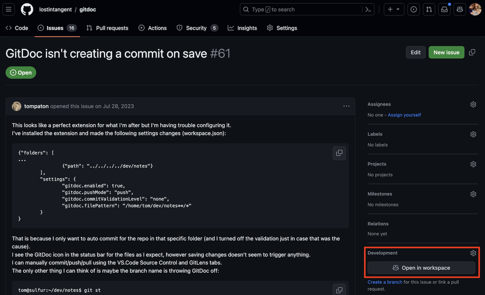

*Open an issue in Copilot Workspace*

This will open Copilot Workspace contextualized to this issue. For issue tasks, the task is based in the title and body of the issue, plus the issue’s comment thread. Copilot Workspace will immediately progress to the next step in the timeline. This looks like this:

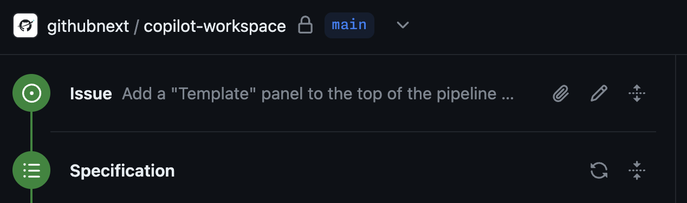

*The task is labeled as “Issue” and analysis begins*

## Specification

In order to help summarize a non-trivial task definition (e.g. an issue with a long comment thread), Copilot Workspace first generates a “topic” for the task, which takes the form of a question that can be posed against the codebase, and used to define the before/after success criteria (see the [specification](#specification) section below). 

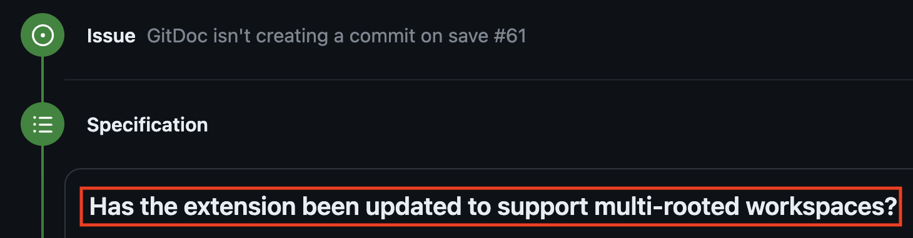

*Note how the topic introduces clarity that is completely missing from the issue title*

You can think of the topic as a way to distill the task down to its essence, and to give you an early and fast opportunity to see if Copilot Workspace is on the right track. If the topic is wrong, you don't need to continue. But if the topic is right, it helps you better understand the task, and to focus on the most important aspects of the codebase that are relevant to the task.

After producing the topic, Copilot Workspace generates a bulleted list describing the current behavior of the codebase, based on the task and topic being posed. This helps build your confidence that Copilot Workspace is on the right track, and serves as a means of onboarding you to the context, in cases where you might not fully understand the current state.

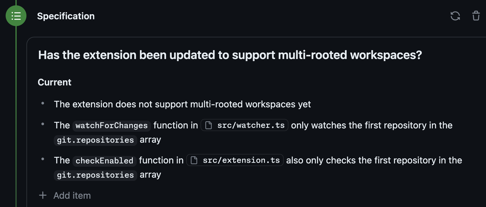

*The current specification answers the question in the topic based on the current state*

And if Copilot Workspace gets anything wrong, then you can easily edit/delete steps from the current spec, or even choose to regenerate an entirely new spec (“try again”). In practice, we find that these tend to be pretty good on the first try.

After the current specification, Copilot Workspace generates a “proposed specification”, which is a bulleted list which articulates the state that the codebase would be in after resolving the task (effectively answering the question in the topic). And in particular, the proposed specification is focused on defining the success criteria of the task, as opposed to getting into implementation details (which is the role of the [plan](#plan)).

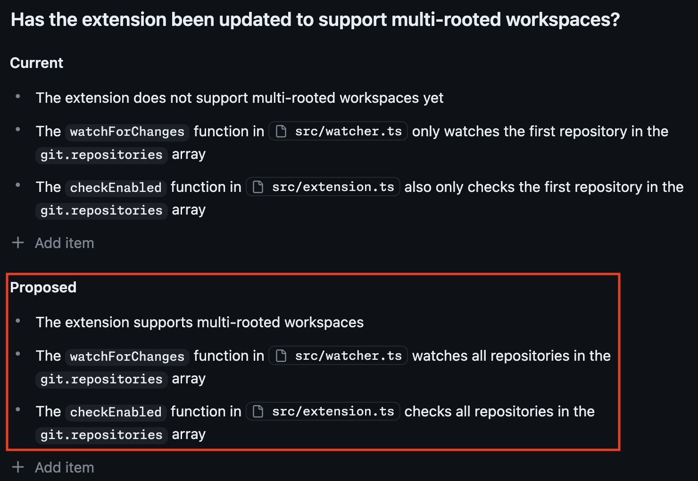

*The proposed specification indicates how to edit the codebase in order to solve the task*

## Content Selection

To generate the current and proposed specifications, and for all following steps, Copilot Workspace needs to identify which files in the codebase are relevant to understanding and completing the task. It does this by a combination of LLM techniques and traditional code search. The contents of the highest-ranked files are then used as context for nearly all steps in the workflow.

Users may review the files selected by Copilot Workspace using the View references” button in the Specification panel. To adjust which files are selected, users can edit the task and use natural language to specify which files are relevant.

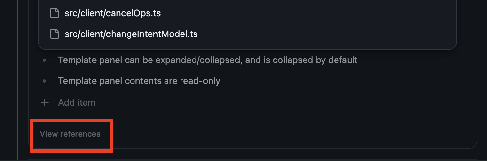

*The references that the model used to generate the original and modified specifications*

## Plan

Once you are happy with the current and proposed specs, you can request Copilot Workspace to generate a plan, which is a list of the files that need to be modified (e.g. edited, created, deleted, moved, or renamed) in order to accomplish the success criteria of the proposed spec. Additionally, each changed file includes a list of specific steps that indicate the exact changes that need to be made.

Like the spec, the plan is fully editable and regeneratable, which allows you to refine and steer Copilot Workspace in the right direction.

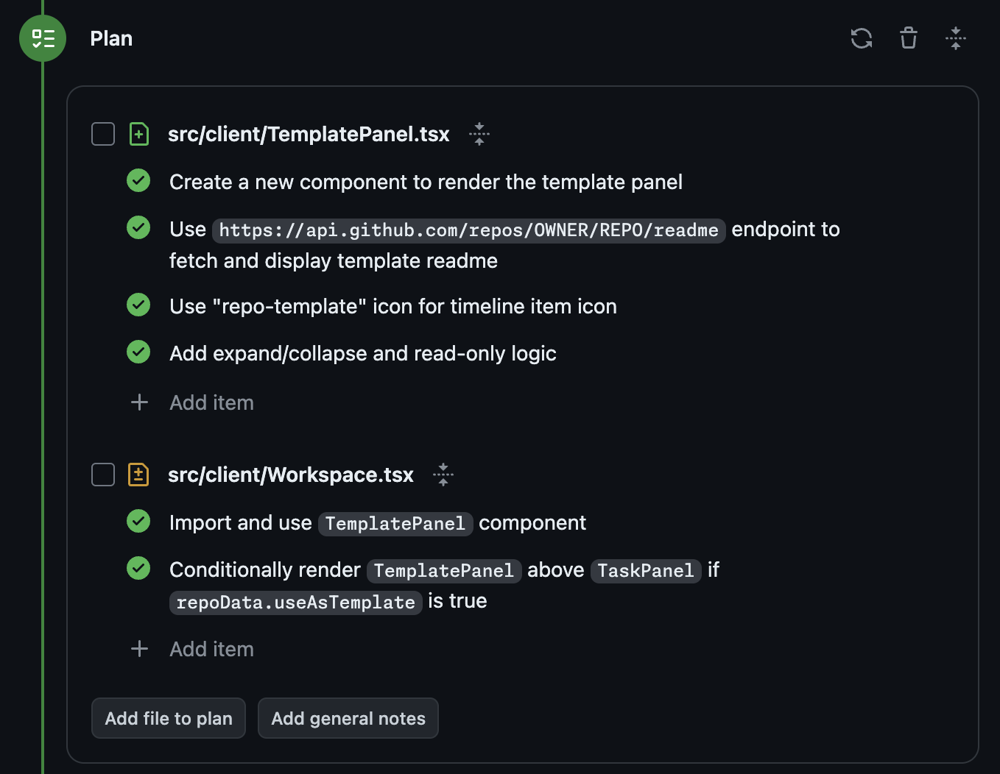

*A plan, showing the steps needed to edit one file and add a second one*

## Implementation

When you are happy with the plan, you can click the “Implement” button in order to begin implementing it. This will update the UI to display a series of queued file updates on the right side, and then begin generating the updated file contents one-by-one. When a file begins generating, its associated entry in the plan will show it as being in progress. And when it completes, the plan will indicate it as being done.

Once a file is implemented, Copilot Workspace renders a diff view for it, and automatically scrolls to the first change. The diff editors are editable, which allows making minor tweaks directly to the code, as opposed to iterating via changes to the task, spec, or plan.

## Iterating on Files

Copilot Workspace doesn't always get everything right, and so it makes it easy for users to iterate on the implementations file by file. Simply add, remove, edit the items in the plan steps for each file, select the checkbox, and click the "Update selected files" button. This will re-generate the contents of the selected files and update the diff view.

For example, you can edit the diff directly, or you can go back to the plan and make changes there. And if you need to make more extensive changes, you can regenerate the plan entirely.

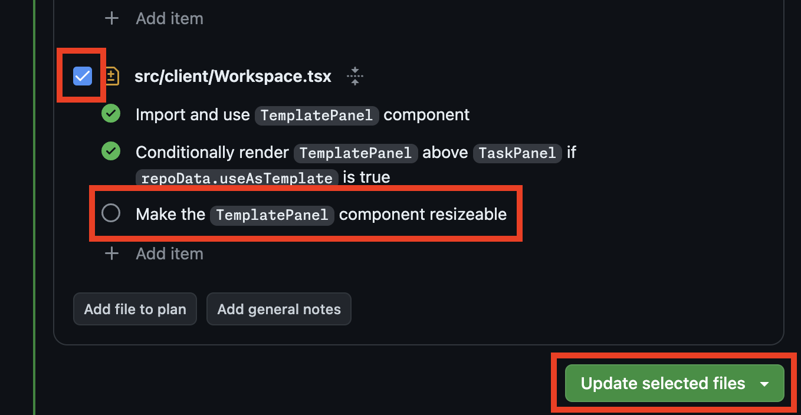

*The plan panel enables users to iterate on implementation file by file*

## Integrated Terminal

Once you have implemented their plan, Copilot Workspace enables you to validate the changes for correctness by bringing up an integrated terminal and executing shell commands. This allows performing a build, lint, test, etc. against the changes, and can be a quick and effective way to gain confidence about the task and its completion status. The terminal is backed by a Codespace, so it is a secure sandbox with a full development environment installed. 

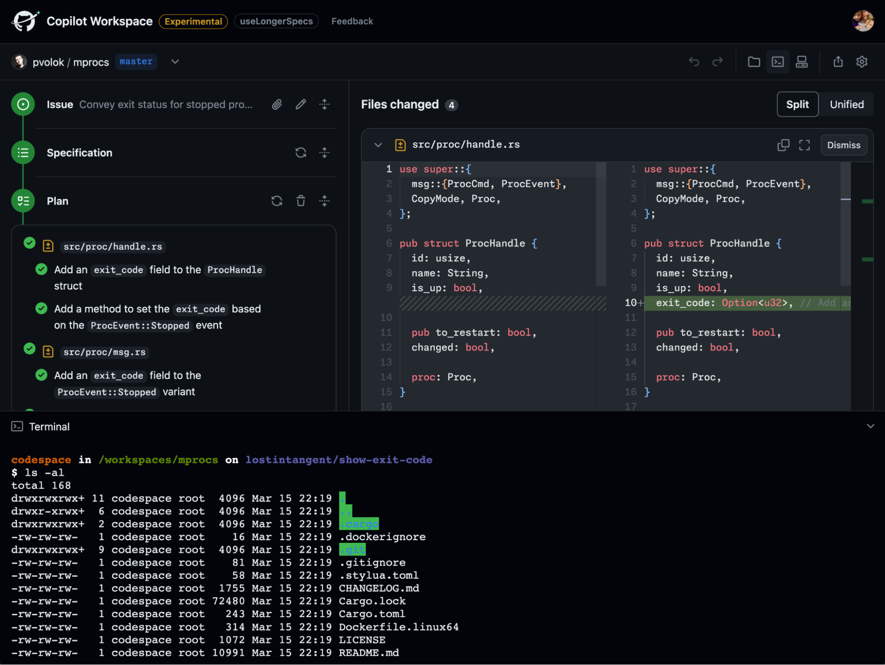

*Integrated terminal, showing the generated branch name and access to just-in-time compute*

If you want to make any more extensive changes or leverage rich editor features (e.g. step debugging), you can open the Copilot Workspace session in a Codespace, using any of Codespace’s supported clients.

## Session Sharing

In order to make it easy to share a workspace session with others (e.g. for doing an ad-hoc code review or sharing an initial implementation idea), Copilot Workspace allows users to generate shared links. These links can be shared with guests, even if they are not part of the Copilot Workspace preview.

Shared sessions are copies of the original session. Non-guest users can use them a as a starting point to continue the task or explore alternative solutions without interfering with the original session. Guest users can view the session but cannot use the workspace to make changes.

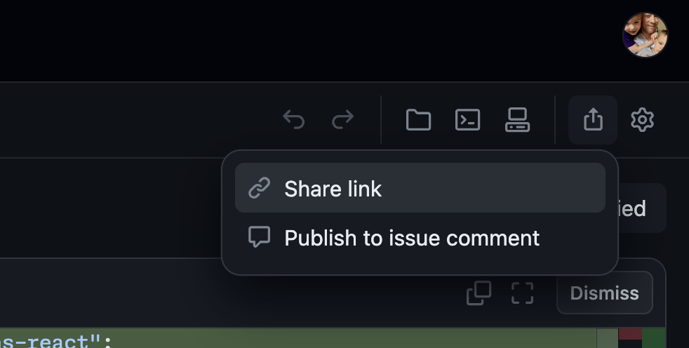

*Generating a share link from the header bar*

When working with issues and pull requests, you can also

* Publish to issue comment. Copilot Workspace automatically generates a comment with a share link for the session, which is included in the issue. This allows reviewers to quickly access the workspace session and see the proposed changes.

* Publish to pull request comment. Similar to the issue comment, Copilot Workspace automatically generates a comment with a share link for the session, which is included in the pull request. This allows reviewers to quickly access the workspace session and see the proposed changes.

## Task Completion

When a task is implemented, validated, and reviewed, you can complete the task in different ways, depending on the type of task you’re working on.

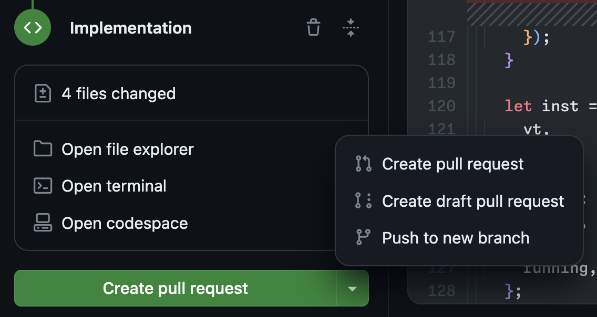

*Creating a pull request for the implemented changes*

| Task type | Available exit paths | 
|-----------| -------------------- |
| Issue | — Create pull request   — Create draft pull request   — Push to new branch   — Push changes to current branch (only available if you have commit permissions to the repo)     These may fork the repository if you do not have write access |
| Ad-hoc task | — *As for issues* |
| PR task | — Update pull request (pushes a new commit with the changes)   — *As for issues* |
| Repo task | — Create repository (creates a new repo from the selected template repo, and includes the changes) |

## Session Dashboard

Copilot Workspace automatically saves your work. It also provides a session dashboard, which allows you to easily resume your work later. You can start a task from your phone and then finish up on your laptop, or vice versa.

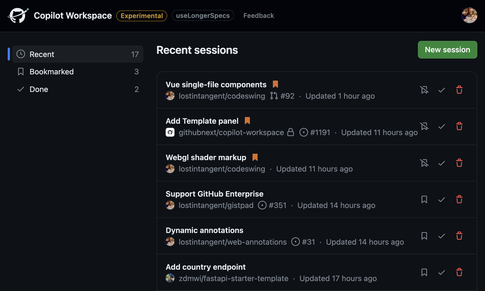

*The Copilot Workspace dashboard showing recent, bookmarked and completed sessions*

Undo and redo are supported within the session via buttons on the toolbar.

## Appendix: Glossary

| Term | Definition |
|------|------------|
| Copilot Workspace | A Copilot-native dev environment that’s designed for exploring and completing every day tasks  |
| Target | A branch of a codebase at a specific commit | 
| Task | A natural language description of a change to a target | 
| Topic | A brief single-sentence summary of a task, usually in question form |
| Specification | A description of the current and proposed state of the target as it relates to the task |
| Plan | A list of files to add, remove or change, with notes about each of them, that together transform the target from its current state to its proposed state |
| Implementation | A set of changes to the target that, when applied, will complete the task |
| Session | A user’s saved progress towards completing a task, a single task can have many sessions |
| Snapshot session | A snapshot of a user’s session, created when you click “Share link”, including both the task progress and UX state |
