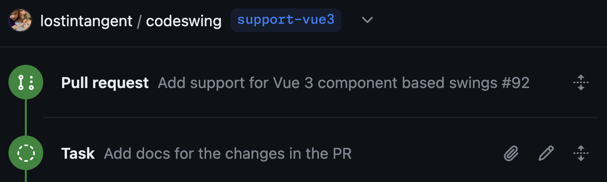

# Refining Pull Requests

Copilot Workspace supports tasks to refine pull requests. 

 *Refine a pull request in Copilot Workspace*

Here you give a task description explicitly, and the task takes into account the specific code changes in the PR.

Once started a pull request task looks like this:

 *A “Pull Request” panel includes the title and description of the PR, along with the task*

After creation, pull request tasks proceed as for issue tasks. On completion, you are offered an additional option to update the pull request.