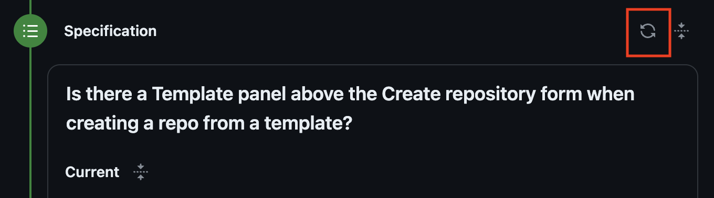
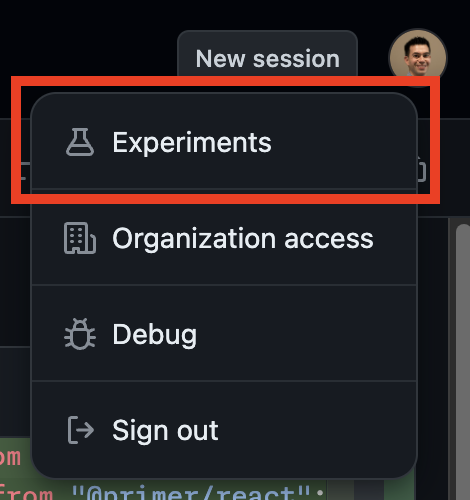
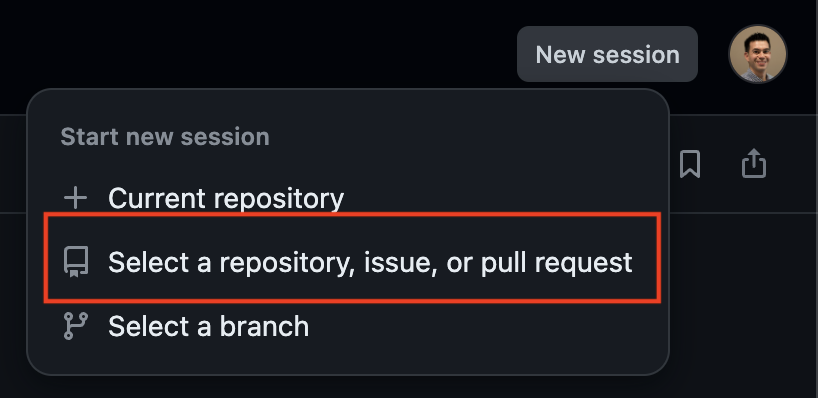
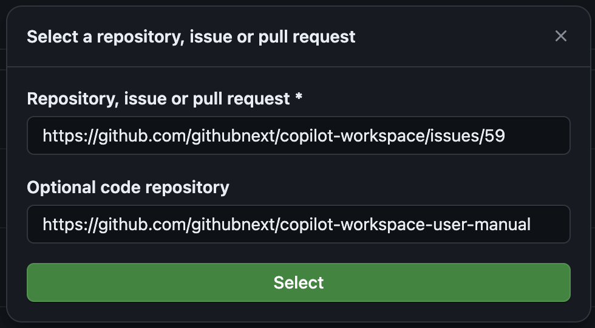

# Tips and Tricks

This document contains assorted tips and tricks for using Copilot Workspace effectively. We'd love to hear your tips and tricks, too! Please share them with us in [feedback channels](README.md#feedback).

## Edit the Issue or Task

✨ TIP: You can edit the issue or task to guide Copilot Workspace.

The Issue/Task panel may be prepopulated with content depending on how you entered Copilot Workspace. For example, if you started from an Issue, the Issue panel will be prepopulated with the content of the issue. This content is ephemeral -- edits aren't synced back to the issue -- and so feel free to edit it to provide more context or to steer Copilot Workspace towards better results.

## Tasks can be short!

✨ TIP: You might be surprised at the effectiveness of simple tasks like "Add unit tests"

Tasks don't have to be long. Simple, clear statements of intent like "Switch to use Python numpy" or "Add more unit tests for the server code" can get you a long way. You can easily add more clarification and iterate.

## Clarify the Issue or Task

✨ TIP: A few words clarifications can make a huge difference!

Just a few words of clarification can make a big difference in the quality of the results you get. For example,

* _add corresponding unit tests in `test/server`_ or

* _the problem is in the convolution code_ or

* _don't change any existing code just add unit tests_

are examples of useful clarifications. Use as many of these as you like!

## Consider using Examples

✨ TIP: Giving examples of what you want can be a great way to clarify a task

For example, you can say: _Here are some examples of command line invocations that should work after the change..._ and give a few examples. Or you can say: _Here are some examples of the expected output..._ and give a few examples.

## Check the Topic and Specification

✨ TIP: Check the topic and specification - if they're accurate, then Copilot Workspace is on the right track

The Topic is your first quick glimpse of Copilot Workspace's analysis of your task in the context of your repository, and the Current Specification follows soon after, then the Updated Specification. If these are accurate, then Copilot Workspace is on the right track. If they're not, then you may need to provide more context, clarifications and hints in the Issue/Task panel, or you may be performing something beyond Copilot Workspace's current capabilities.

You can edit all of these to correct them, and checking them quickly can save you a lot of time. You can also go back and clarify the issue or task and try again.

## Check the Content Selection

✨ TIP: Check the content selection and use short notes in the issue or task to say where to look

You can [check the content selection used](overview.md#content-selection). Often the content selection can be improved, and right now you do this through natural language and notes on the issue/task. If you know where the code that needs to be changed is, you can say so in the issue/task panel. For example, you can say: _Look in `src/server.js`_ or many other variations.

To determine how to address a task, Copilot Workspace must determine which files in a repo are relevant to the task. This is hard, and Copilot Workspace may not always select the right files. If that happens, you may see low-quality results.

To review the files that were selected, in the Specification panel, click the "View references" button:

To steer Copilot Workspace towards better file selection, you can mention file names, directory names, etc. in the issue/task panel. Just write it naturally, as if you were writing a normal issue.

## If at First You Don't Succeed...

✨ TIP: Try regenerating the spec or plan

If you're not happy with the results you're getting, you can try regenerating the spec and/or plan. To do this, click the "Regenerate" button in the Spec or Plan panels:

## Iterating on the Implementation

✨ TIP: Add short notes to files in the plan, then iterate

Often Copilot Workspace will get a task *mostly right*, but may have trouble with some parts. In this case, you can reimplement specific files with new or additional instructions. After implementing and reviewing the code, you can select file(s) in the Plan panel and add bullet points, then click "Update selected files" to reimplement those file(s) with the new instructions that you've provided.

## Add New Files and Iterate

✨ TIP: You can add new files and iterate on the implementation

If you need to add new files to the implementation, you can do so by clicking the "Add file" button in the Plan panel. This will add a new file to the plan, which you can then implement and iterate on.

## Consider Generating New Files

✨ TIP: Generating new files can be better than appending to existing files

This technical preview of Copilot Workspace uses "whole file rewriting". This means that when you ask Copilot Workspace to add code to a file, it will replace the entire file with the new code. When performing tasks like writing unit tests or generating documentation or new implementation code, it can be easier and quicker to generate new files, then rename them.

## Share Early, Share Often

✨ TIP: You can share your session at any time, including with people who are not part of the Copilot Workspace preview.

You can share your Copilot Workspace session with others by clicking the "Share" button in the top right corner of the screen. This will generate a link that you can share with others. These links can be shared with guests, even if they are not part of the Copilot Workspace preview. They will need to log in with their GitHub account to view the session.

Shared sessions are copies of the original session. Non-guest users can use them a as a starting point to continue the task or explore alternative solutions without interfering with the original session. Guest users can view the session but cannot use the workspace to make changes.

## Use the Sessions

✨ TIP: Return to your work at any time

Your sessions are automatically saved, so you won't lose work if you close the browser or navigate away from the page. You can return to your session by going to [your Copilot Workspace dashboard](https://copilot-workspace.githubnext.com).

## Confgure the Terminal for Your Repository

✨ TIP: Set up a `devcontainer.json` file in your repository to configure the terminal

We provide a built-in terminal so that you can validate the code changes that Copilot Workspace suggests. We use GitHub Codespaces to provide this terminal, and we use the `devcontainer.json` file in your repository to configure the container that powers the terminal. If you need to make changes to the default container to e.g. install necessary software, etc., you can do so by creating a `devcontainer.json` file in your repository. Learn more about Development Containers at https://containers.dev/.

## Use the Codespace

✨ TIP: Full editing in the Codespace is simple and quick

Modified files are two-way-synced between Copilot Workspace and the terminal/Codespace. Feel free to edit in either place, and your changes will be reflected in the other.

Check out [Codespaces Guide](./codespaces-guide.md) for more information.

## Explore the Experiments!

✨ TIP: Explore our experiments and send us feedback!

We're always trying new things in Copilot Workspace. You can opt into our current experiments by clicking on your avatar in the top right corner of the screen and selecting "Experiments":

## Work Around Model "Laziness"

✨ TIP: If the model is "lazy" and elides chunks of edited files, copy and paste the missing parts from the diff

Sometimes the model will be "lazy" and elide chunks of edited files. If you see this happening, you can copy the missing parts from the left-hand side of the diff and paste them into the right-hand side.  We know that's not ideal, and we're working hard on this issue.

## What If Your Issues and Code Are in Separate Repos?

✨ TIP: Use the "New session" button to tell Copilot Workspace where your issues and code are

If your issues and code are in separate repositories, you can use the "New session" button on a session page to tell Copilot Workspace where your issues and code are. This will allow Copilot Workspace to analyze your issues in the context of your code.

