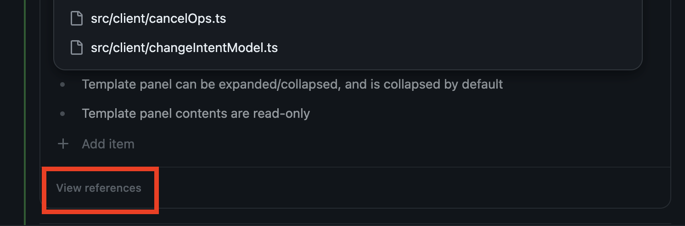
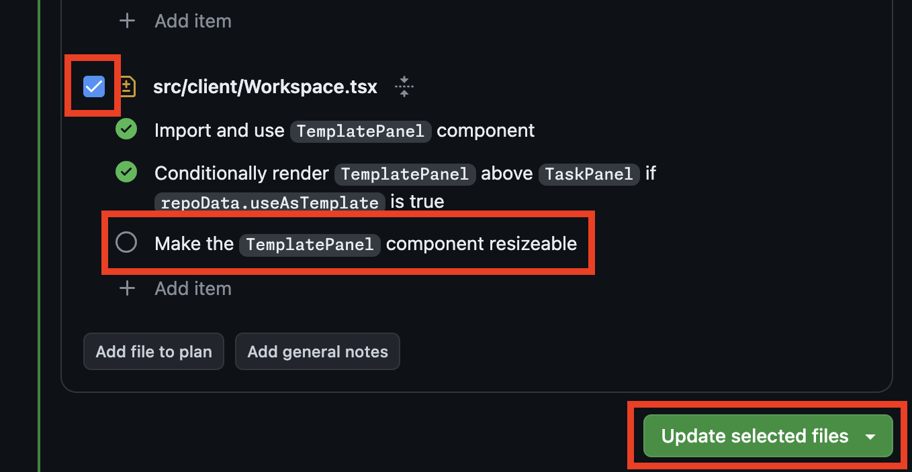

# Tips and Tricks

This document contains assorted tips and tricks for using Copilot Workspace effectively.

## File Selection

To determine how to address a task, Copilot Workspace must determine which files in a repo are relevant to the task.  
This is hard, and Copilot Workspace may not always select the right files.  If that happens, you may see low-quality 
results.  

We're working hard to improve this, but in the meantime, you can help by reviewing and steering the file selection.

To review the files that were selected, in the Specification panel, click the "View references" button:

To steer Copilot Workspace towards better file selection, you can mention file names, directory names, etc. in the issue/task panel.  Just write it naturally, as if you were writing a normal issue.

## The Issue/Task Panel

The Issue/Task panel may be prepopulated with content depending on how you entered Copilot Workspace.  For example, if you started from an Issue, the Issue panel will be prepopulated with the content of the issue. This content is ephemeral -- edits aren't synced back to the issue -- and so feel free to edit it to provide more context or to steer Copilot Workspace towards better results.

## If at First You Don't Succeed...

If you're not happy with the results you're getting, you can try regenerating the spec and/or plan.  To do this, click the "Regenerate" button in the Spec or Plan panels:

## Iterating on the Implementation

Often Copilot Workspace will get a task *mostly right*, but may have trouble with some parts.  In this case, you can reimplement specific files with new or additional instructions.  After implementing and reviewing the code, you can select file(s) in the Plan panel and add bullet points, then click "Update selected files" to reimplement those file(s) with the new instructions that you've provided.

## Sharing Copilot Workspace Sessions

You can share your Copilot Workspace session with others by clicking the "Share" button in the top right corner of the screen.  This will generate a link that you can share with others.  These links can be shared with guests, even if they are not part of the Copilot Workspace preview.

Shared sessions are copies of the original session.  Non-guest users can use them a as a starting point to continue
the task or explore alternative solutions without interfering with the original session.  Guest users can view the session but cannot use the workspace to make changes.

## Auto-Saved Sessions

Your sessions are automatically saved, so you won't lose work if you close the browser or navigate away from the page.  You can return to your session by going to [your Copilot Workspace dashboard](https://copilot-workspace.githubnext.com).

## Separate Repos for Issues and Code

<!-- TODO(eaftan): fill this in -->

Some teams use separate repositories for issues and code.  If you're working in a repository that's different from the one where the issue was filed, you can still use Copilot Workspace.  TODO.

## Conifgurating the Terminal for Your Repository

We provide a built-in terminal so that you can validate the code changes that Copilot Workspace suggests.  We use GitHub Codespaces to provide this terminal, and we use the `devcontainer.json` file in your repository to configure the container that powers the terminal.  If you need to make changes to the default container to e.g. install necessary software, etc., you can do so by creating a `devcontainer.json` file in your repository.  Learn more about Development Containers at https://containers.dev/.

## Using the Terminal or Codespace to Edit Files

Modified files are two-way-synced between Copilot Workspace and the terminal/codespace.  Feel free to edit in either
place, and your changes will be reflected in the other.

## Undo/Redo

Undo and redo are supported via the standard keyboard shortcuts: `Ctrl-Z` and `Ctrl-Y` on Windows and Linux, and `Cmd-Z` and `Cmd-Y` on macOS.

## Experiments

We're always trying new things in Copilot Workspace.  You can opt into our current experiments by clicking on your avatar in the top right corner of the screen and selecting "Experiments":

