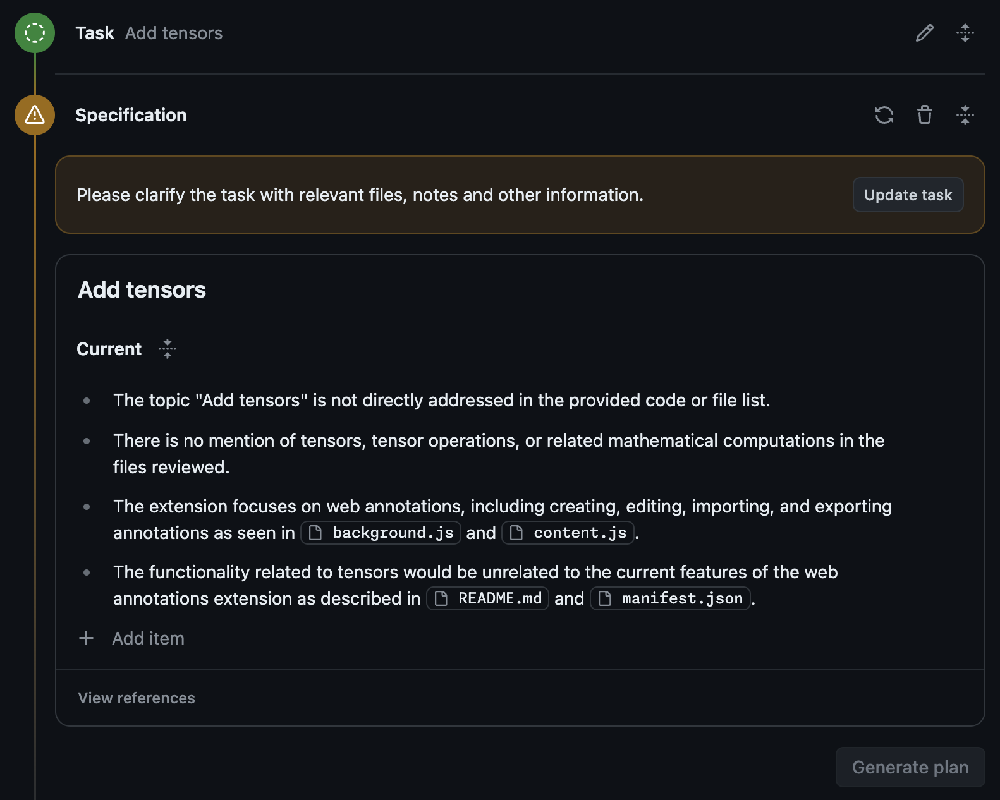

## Troubleshooting

### Introduction

Welcome to the troubleshooting guide for Copilot Workspace! In this section, we will provide you with helpful tips and solutions to common issues you may encounter while working with organizations and private repositories in Copilot Workspace. Our goal is to ensure that you have a smooth and productive experience. Let's dive in!

### Troubleshooting Organizations

When working with organizations in Copilot Workspace, you may encounter some common issues. Here are some troubleshooting tips to help you resolve them:

- **You are accessing an org that must approve OAuth apps**. As part of the login you authorize the OAuth app into various orgs, depending on the org policies with regard to OAuth apps. You can request access and the organization can approve the OAuth app. If you need to re-request access or revoke any access at all you can [control the status of your connection with the OAuth app](https://github.com/settings/connections/applications/903eccd8a9d2ff50288f).

- **Although you appear to have the correct authorization credentials, the `github` organization has enabled OAuth App access restrictions, meaning that data access to third-parties is limited.** This is because an org restricts OAuth apps. Some of authorization attempts for orgs may fail if the org doesn't allow OAuth apps at all. This can affect even access to public repositories in organizations that deny access to OAuth apps.

- **Resource protected by organization SAML enforcement. You must grant your OAuth token access to this organization**.You may be logging in to an organization with SAML control, e.g. Microsoft. They should
  1. Log out of Copilot Workspace.
  2. Go through SAML auth in the browser by looking at, say, a repository of the organization
  3. Then log back into Copilot Workspace.
 
- **Other known limitations to working within organizations:**
  1. The enterprise (or org) must opt-in to Copilot feature previews.
  2. The enterprise (or org) has set the Copilot Extension policy to Enabled.
  3. The enterprise must not be using EMUs
  4. Developers within the enterprise (or org) must have paid Copilot licenses

### Troubleshooting Private Repositories

- **You can't access a private repository in your own account**. After login you should be able to access your personal private repositories unless you have removed access for the OAuth app. If you have trouble, it is possible it is because you landed in Copilot Workspace via a sharing link and have only given public repo privileges. You should log out and log back in again and this should restore access. Failing that you should [check the status of their connection with the OAuth app](https://github.com/settings/connections/applications/903eccd8a9d2ff50288f).

## Ambiguity Warnings

If Copilot Workspace detects that your task is overly ambiguous/unclear (e.g. it doesn’t seem aligned with the goals/focus of the repo), then it may warn you about that and ask you to clarify the task further, before you can carry on. This is done to prevent hallucination in the specification and help guide you towards the “pit of success”, since subsequent stages of the workflow work best with sufficient detail.

*A warning that a task is too ambiguous and that their intent needs to be clarified*

### Troubleshooting Codespaces

- **Billable owner could not be determined for a new codespace, Repository may not be used for a codespace.** The CW OAuth app is not installed in the billable owner's organization.

Please view the [Codespaces Guide](codespaces-guide.md) for more information on Codespaces and troubleshooting common errors.
