# GitHub Copilot Workspace VS Code extension

This Copilot Workspace VS Code extension allows you to use GitHub Copilot Workspace from the comfort of VS Code. Continue an existing session and edit and debug the proposed changes before creating a PR. Whether you use natural language to revise the plan or implementation, or edit files directly, you can use the full power of VS Code and its extension ecosystem all while syncing your local edits to GitHub Copilot Workspace on the web automatically (any saved file change will be visible online within few seconds).

This is currently an alpha extension and we will be rolling out enhancements to the extension in multiple phases.

1. **Continue on:** Browse your Copilot Workspace sessions and sync changes so you can edit and debug your application in VS Code locally, using one of the other [VS Code Remote extensions](https://marketplace.visualstudio.com/items?itemName=ms-vscode-remote.vscode-remote-extensionpack), or in your own [Codespace](https://github.com/features/codespaces).

2. **[IN-PROGRESS] Update your workspace using AI**:

    - **Available:** Brainstorming, natural language revisions to the plan and files in the plan, adding/editing/deleting plan files or steps.
    - **Planned**: Support for editing the task and answer text.

3. **[FUTURE] Create new:** While not available now, you'll be able to create a new Copilot Workspace session in VS Code.

## Getting started

* [Quick Start](#quick-start)
* [Browsing Sessions](#browsing-sessions)
* [Managing Sessions](#managing-sessions)
* [Planning and Implementing](#plan-and-implement)
* [Natural Language Revisions](#natural-language-revisions)
* [Brainstorming](#brainstorming)
* [Known Limitations](#known-limitations)

### Quick Start

1. If you haven't already, install [Visual Studio Code](https://code.visualstudio.com/).

1. Next, open a session [on the web](https://copilot-workspace.githubnext.com) that you'd like to continue working on in VS Code.

1. Click on the `VS Code` button in the session screen.

    

1. Allow your browser to open the link in VS Code when prompted.

Follow the directions that appear in VS Code and make any selections when prompted, and you'll be guided towards syncing the session to your local machine. That's it! 😎

Here is generally what you can expect to see:

1. VS Code will open (if it isn't already running), and you'll be prompted to install the Copilot Workspace extension and then open the URI. If the extension is already installed, you'll just be asked about the URI. Either way, open the URI.

    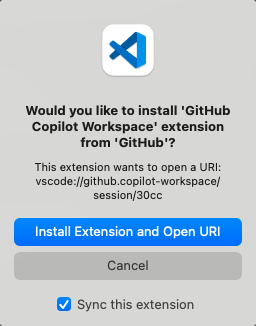

1. **[One time]** If you haven't signed in already, you'll be prompted to do so. Click the `Sign in` and complete the sign in process in the browser that opens.

    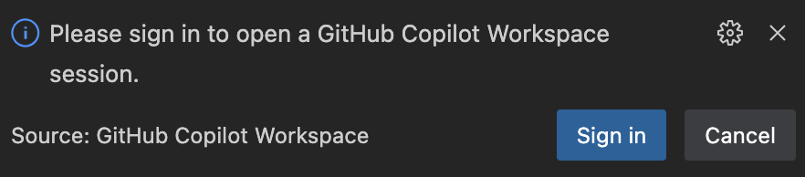

1. If the VS Code instance already has a folder with the related repository in it open, the extension will immediately start syncing the session locally. Otherwise you may be prompted to clone the repository or pick an existing folder with it in it.

    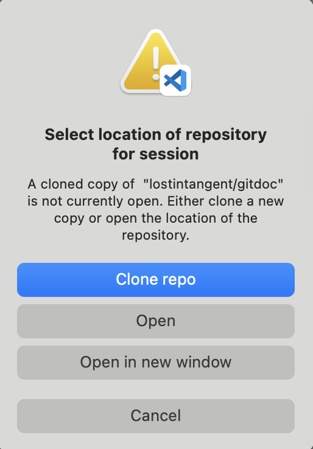

Once syncing has begun, your local repository will switch to GitHub Copilot Workspace tracking branch with a `ghcw-session` prefix as you can see in the status bar. This is a temporary branch for this session, so you should **not** push your local changes.

Any edits made to the local files will be automatically synced back to the web session. You only have to save a local file and your change will be visible within a few seconds online (no need to push anything). This allows you to use the full power of VS Code with GitHub Copilot Workspace.

However, if you picked a session that doesn't yet have an implementation with updated files to start syncing, you'll be notified that you can start syncing once you [have an implementation](#planning-and-implementing).

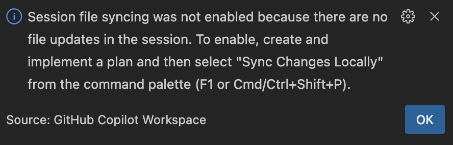

In addition to editing and debugging, you can also make [revisions using natural language](https://github.com/githubnext/copilot-workspace-user-manual/blob/main/vscode.md#natural-language-revisions) or adjust the [plan and implementation](https://github.com/githubnext/copilot-workspace-user-manual/blob/main/vscode.md#planning-and-implementing). When you're done, you can either:

-   Create / update a branch and optionally create a PR by clicking on the **Push Changes into Branch...** icon in the `Plan` view using the command palette (F1 or Cmd/Ctrl+Shift+P).
-   Or hop back on the web to push updates to the original branch or create a PR from your session. There's a quick access link in the `...` menu on top of the `Plan` and `Task` views.

## Browsing Sessions

Even if you are not syncing a session locally, you can still browse through your sessions and view their details. To browse and manage your sessions, first click on the `GitHub Copilot Workspace` icon in the activity bar on the left side of the VS Code window.

After you've clicked the activity bar icon, you'll either see a list of your sessions, or details about a specific session you've already selected.

The session list is sorted by repository. Any repository that applies to currently opened VS Code folders will be on top. You can always get back to the session list when viewing session details by clicking on the `Back to Session List` arrow in the `Task` view or using the **GitHub Copilot Workspace: Back to Session List** command from the Command Palette (F1 or Ctrl/Cmd+Shift+P).

Selecting a session in the session list will hide the list and show the related session details instead. A `Task` (or Issue or Pull Request) view and `Plan` view will be visible.  Each view can be expanded into a larger panel by clicking on the "full screen" icon.

The `Task` view includes a description of the task along with links to additional information. The `Plan` view will include details about the related plan for your session (if one exists yet) and any files currently in the plan.

If the [plan has already been implemented](#planning-and-implementing), you'll be able to view any changed files by clicking on the file in the plan.

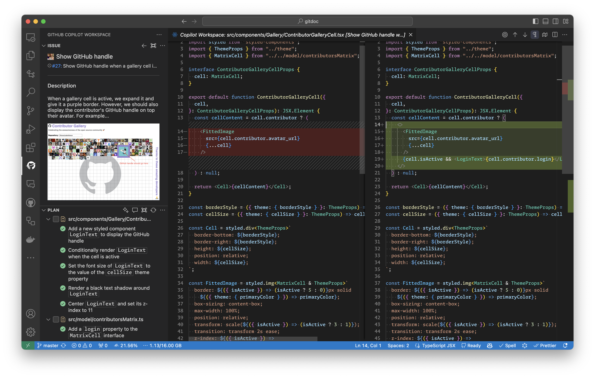

When syncing is active, clicking on the file will open a local changes view of the synced contents. This view is editable and the changes will be synced back to the web session. If the session is not syncing, you will see the changes currently stored in the web session in a read-only mode.

You can also click on the `Open File` icon when hovering on a file in the plan to open the file (instead of the changes view) in a new tab in VS Code. You may be prompted to start syncing the session if you are not already.

## Managing Sessions

You can sync session file changes locally for any session that has a plan and an initial implementation.

If the session you opened does not yet have an implementation, see [Planning and Implementing](#planning-and-implementing) for information on creating one from VS Code. You can then sync its contents locally once done.

### Stopping Syncing Changes

The quick start highlighted a fast way to start syncing your session's changes locally, so let's cover how to stop syncing changes next.

If the session list is visible, you will see a green checkbox next to any session that is currently being synced. When hovering over this session, you will see a `Stop Syncing Changes` button. Otherwise, if the session details are visible for a session that is currently syncing, you will find this same button in the `Plan` view. Simply click this button in either location to stop syncing.

| Session List | Session Details |
| :--- | :--- |
| 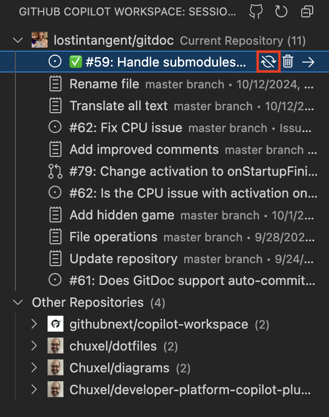 | 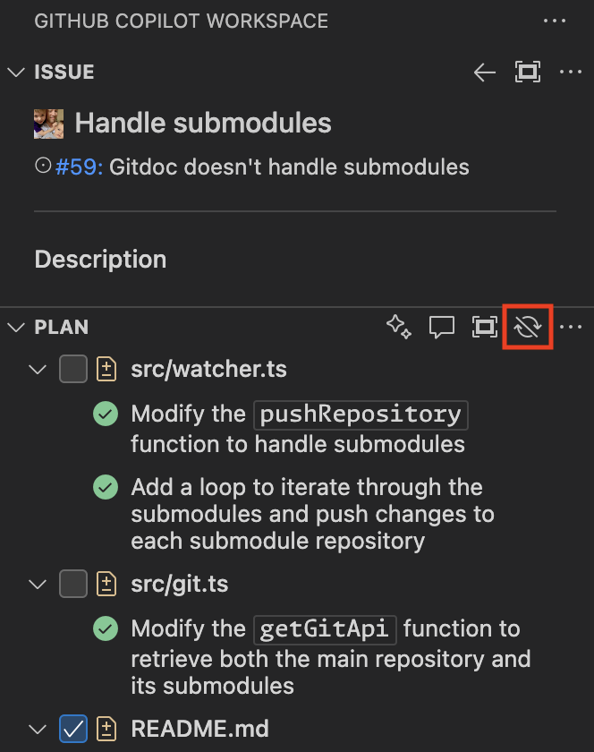 |

Alternatively, you can use the Command Palette (F1 or Ctrl/Cmd+Shift+P) and select the **GitHub Copilot Workspace: Stop Syncing Changes** command when you have the session details open.

You'll be switched back to the branch you where on when you started syncing changes, or **main** (or master) if nothing else. Since the changes you made locally are kept in sync automatically when syncing is active, the working tree is also cleaned out so you can easily jump in and out of sessions.

The next time you sync this same session, the session will go back to this tracking branch and the latest changes in GitHub Copilot Workspace - including your edits - will appear again.

Note that if you manually change the branch away from the one set when syncing began, syncing will also automatically stop. However, in this case, any changes you made will be kept in the working tree to make sure you don't lose something you intended to keep. Stopping syncing as described above will ensure you've got a clean working tree to continue making other changes.

### Syncing Changes Locally

As outlined in the quick start, you can always click on the VS Code icon in the GitHub Copilot Workspace web UI to start syncing changes locally. But you can also start syncing a session directly from within VS Code. 

However, as described in the previous sections, note that only sessions with a [plan and an initial implementation](#planning-and-implementing) can be synced locally.

If session list is visible, hovering over a session that is not currently being synced (no green checkbox), will show a `Stop Syncing Changes` button. Otherwise, if the session details are visible instead, you will see this same button in the `Plan` view (assuming syncing is inactive for this session). Click this button to start syncing changes for the session locally. 

Note that any other existing session that is already syncing for the same repository will automatically stop syncing first, so you don't have to worry about conflicts.

| Session List | Session Details |
| :--- | :--- |
| 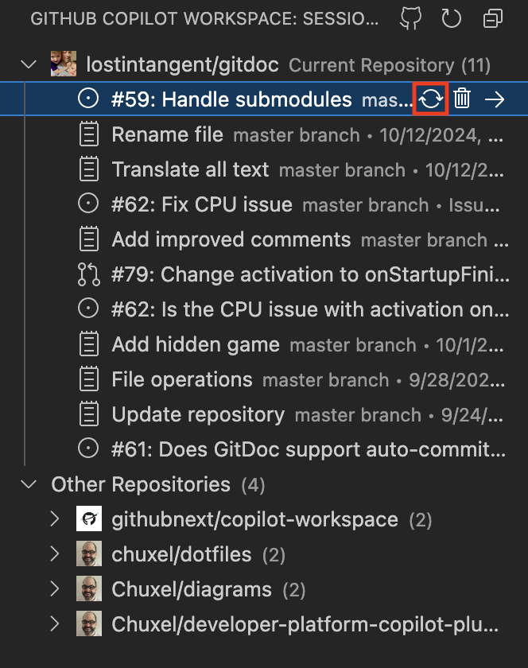 |  |

Similarly, you can use the Command Palette (F1 or Ctrl/Cmd+Shift+P) and select the **GitHub Copilot Workspace: Sync Changes Locally** command when you are in the detail view for a session to start syncing.

Next you may be prompted as follows:
1. If you do not currently have the repository for the session open in VS Code, you will be prompted to open a folder with the repository or to clone the repository in a fresh location.
1. If you do have the correct repository open, but the current working tree has uncommitted changes, you'll be asked what you want to do with them.

Either way, once this is done, your local repository will be on a GitHub Copilot Workspace tracking branch with a `ghcw-session` prefix as you can see in the status bar.

Regardless, any edits made to local files will be synced back to the web session, so you do not need to worry about committing or losing your changes.

### Visibility to Sync Status and Processing State

Since you won't always have the `Plan` view visible while you work, GitHub Copilot Workspace has a status bar item that can help you understand what the extension is doing at any given moment. Here are some examples of what you will see:

| Example | Description |
| :--- | :--- |
|  | The extension is signed in, but but idle. |
|  | Syncing is enabled for a session, but the extension is currently idle. |
|  | The extension is performing an operation indicated by the text (`Starting implementation...`) and has a spinning loading or sync icon (when files are transferring). |
|  | Here, an error occurred while syncing. Clicking on the status bar item will show more information. |

Clicking on the status bar item will take you to the session details for the session you are syncing (or the session list if you are syncing multiple sessions in a multi-root workspace with multiple repos). The status bar will also turn red if a sync error has occurred, and clicking on it should provide you options to remediate the issue.

#### Plan View Banner

However, if you do have the `Plan` view up, you can look at the status banner to see what is happening and in some cases take quick actions based on the current state.

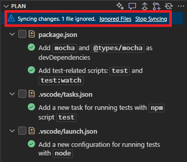

### Pushing Session Changes to a Branch or PR

While the extension automatically syncs changes to the web, you may want to push your changes to a branch or create a PR from the session. This is useful when you are either done with the session, or you want to keep changes to something that is not automatically synced - like something in the .gitignore file or large files that you received a notification where ignored.

Thankfully, you can use the following buttons in the `Plan` view when you are syncing a session to perform these actions. Note that the command name in this table is also the name of the command in the **Command Palette** (F1 or Ctrl/Cmd+Shift+P) when the appropriate session is visible in the side bar.

| Button | Command | Description | Location(s) |
| :--- | :--- | :--- | :--- |
|                | Push Changes into Branch... | Pushes changes to a new or existing local branch, optionally pushes them remotely too. | Plan view when file syncing is enabled, `...` context menu. |
|  | Create PR from Changes...   | Pushes changes to a specified remote branch, then opens the PR UX in VS Code to let you enter details on the request. | Plan view when file syncing is enabled, `...` context menu. |

### Deleting a Session

To delete a session, you click on the trash can icon next to the item in the session list. If you are currently viewing a session's details, select **Delete Session** from the context menu that appears when clicking on the `...` button on the `Task` or `Plan` views.

Alternatively, you can use the Command Palette (F1 or Ctrl/Cmd+Shift+P) and select the **GitHub Copilot Workspace: Delete Session** command when you are viewing a session's details.

## Planning and implementing
When the session details are visible (and you see the `Task` and `Plan` views), you can make changes to the plan and its related implementation for the session right from VS Code.

In fact, you can also generate and implement an initial plan if your session doesn't have one yet. 

You will find a number of different options for interacting with the plan by clicking on the `...` button in the `Plan` view. However, the most common actions will appear as icons. The table below outlines what each of these does. Note that the command name in this table is also the name of the command in the **Command Palette** (F1 or Ctrl/Cmd+Shift+P) when the appropriate session is visible in the side bar.

| Button | Command | Description | Location(s) |
| :--- | :--- | :--- | :--- |
|  | Generate Plan | Generates a plan for the session and creates an inital implementation. | Plan view when no plan exists. Regenerate plan is available in the  `...` context menu afterwards. |
|  | Implement Plan | Implement (or re-implement) the selected items in the plan view. | Plan view when plan exists, `...` context menu. |
|  | Revise Plan | Make revisions to the entire plan using natural language. Will automatically implement the requested changes. | Plan view when plan exists, `...` context menu. |
|  | Sync Changes Locally | See Managing Sessions. Start syncing session changes locally. | Plan view if there is an implementation, and the session is not already syncing, `...` context menu. |
|  | Stop Syncing Changes | See Managing Sessions.  Stops syncing session changes locally. | Plan view if the visible session is already syncing, `...` context menu. |
|                | Push Changes into Branch... | Pushes changes to a new or existing local branch, optionally pushes them remotely too. | Plan view when file syncing is enabled, `...` context menu. |
|  | Create PR from Changes...   | Pushes changes to a specified remote branch, then opens the PR UX in VS Code to let you enter details on the request. | Plan view when file syncing is enabled, `...` context menu. |

The `...` context menu is also available for files and items in the plan when you hover over them. This context menu will allow you to view the files, their changes, or edit, move, delete, or the list items as needed.

### Natural Language Revisions

You can also make revisions to the plan and implementation using natural language. This can be done for the entire plan as highlighted previously, or you can make targeted revisions to a file in the plan. You can even add another file to the plan and revise it in one shot.

To make file-level revisions easy, there are buttons in the upper-right of any open editor window for a file that can be part of the plan.

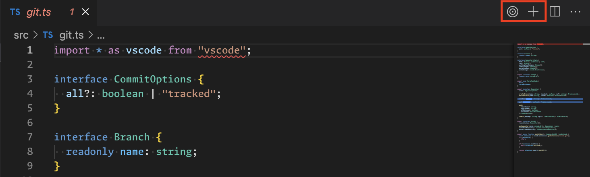

Here's a summary of where you can trigger these kinds of revisions:

| Button | Command | Description | Location(s) |
| :--- | :--- | :--- | :--- |
|  | Revise Plan | Make revisions to the entire plan using natural language. Will automatically implement the requested changes. | Plan view when plan exists, `...` context menu. |
|  | Revise File | Make targeted revisions to a file using natural language. Will automatically either add the file to the plan or add a step to an existing entry, and then implement the requested changes. | Plan file items (hover), Editor actions (upper-right), `...` context menu. |
|  | Add File to Plan | Adds the file to the plan, but makes no revisions to it. | Editor actions (upper-right), `...` context menu. |

## Brainstorming

> Note that this feature is new to Copilot Workspace, so you may encounter more rough edges than other parts of the experience. Please let us know if you have any feedback!

Brainstorming provides a way for you to interact with Copilot Workspace to refine the task you want to perform. You can ask or select suggested questions to learn more about potential options for your task and then add the answers you like as additional context to use when planning and implementing. This feature is now available in VS Code so that you can refine your initial task and plan directly from your editor.

### Accessing the Brainstorming panel

You can access brainstorming in a few ways. First, you can click on one of the following buttons to get started. As in other cases in this document, the Command column contains the name of the command in the **Command Palette** (F1 or Ctrl/Cmd+Shift+P) when the appropriate session is visible in the side bar.

| Button | Command | Description | Location(s) |
| :--- | :--- | :--- | :--- |
|  | Brainstorm | Opens the `Brainstorming` panel. If the question "How should I solve this task?" has not already been answered (aka the "spec" has not been created yet), you will see that start at this point. | Task view, `...` context menu. |
|  | Answer New Question... | Lets you ask Copilot Workspaces a specific question, and the `Brainstorming` panel then appears with the answer. | Task view, `...` context menu. |

The `Task` view also includes a list of questions or answers that have already been added to the task in a section after the description. You can click on any of these to see the answer in the `Brainstorming` panel and continue brainstorming.

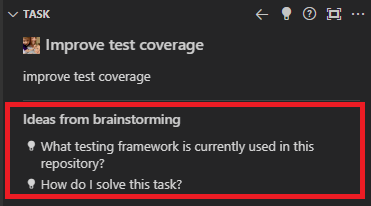

### Using the Brainstorming Panel

When you open the `Brainstorming` panel, you will see the current answer to a question. By default this will be the question "How should I solve this task?" which is always added to the Task. You will then see a series of buttons at the top with possible actions. 

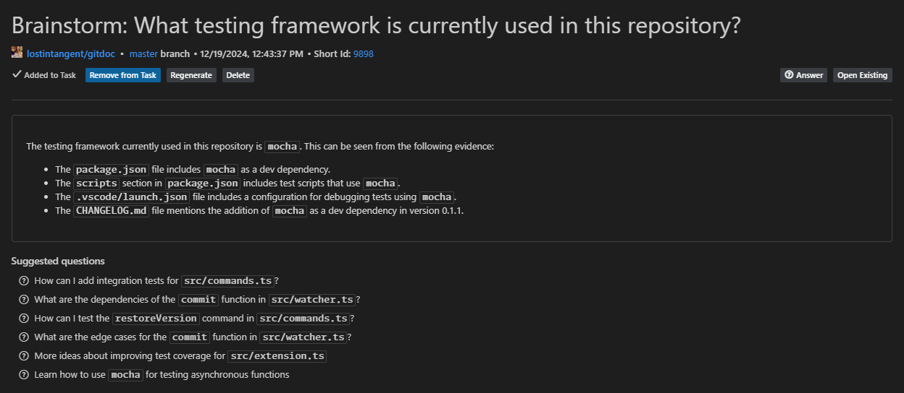

Let's go through the buttons you may see and what they do.

| Button | Description |
| :--- | :--- |
| **Add to Task** | Adds the current answer to the task. This will also automatically trigger regeneration of the "How should I solve this task?" question / spec. Note that answer to any question added to the task will appear in below the task description in the `Task` view. |
| **Remove from Task** | Removes the current answer from the task. This will also automatically trigger regeneration of the "How should I solve this task?" question / spec. |
| **Regenerate** | Asks Copilot Workspace to try to answer the question again. |
| **Delete** | Deletes both the question and its related answer from the list of existing answers. |
| **Answer** | Lets you ask Copilot Workspace a new question. |
| **Open Existing** | Displays a list of answers that have already been generated that you can open in the `Brainstorming` panel. Any answers that have been added to the task will have a check next to them. Useful if you did add an answer to the task or removed it, and changed your mind. |

#### Multiple Answers

Sometimes you may also be presented with multiple possible answers to a question. In this case, you can select the one you want to add to the task by clicking on the empty circle next to the option - which will then turn into a green checkmark indicating its been added. If you change your mind, you can click on the checkmark to remove it.

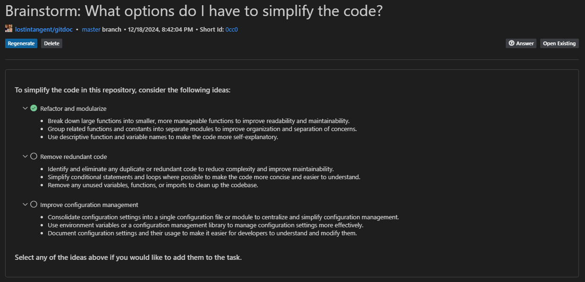

#### Suggested Questions

In addition, below the current answer for the question, you will see a list of **suggested questions** that may apply to your task. You can click on any of these to see the answer in the `Brainstorming` panel.

### Updating the Plan When You Are Done

When you are done brainstorming, you can regenerate your plan by clicking `...` in the `Plan` view and selecting **Regenerate Plan**. (And if you don't have a plan yet, you can generate one by clicking `...` in the `Plan` view and selecting **Generate Plan** as described previously.)

However, if you are generally happy with the plan as it exists, you can make a **[natural language revision](#natural-language-revisions)** to factor in the new information in a more specific way.

## Known Limitations

**Features:** As outlined above, you need to use the web UI for the following as they are not yet available in VS Code:
* Starting a new session
* Direct text edits to the task or an answered question

**File syncing:**
* File syncing has some limitations placed on it during the technical preview such as not syncing binary files, certain paths or file types, or files over a certain size. These limitations are subject to change as we continue to improve. When using the VS Code extension directly you will be notified when one of these limitations has been hit, and can see which files have been ignored from the **GitHub Copilot Workspace: Show Files Ignored While Syncing** command from the command palette (F1 or Ctrl/Cmd+Shift+P).
* File syncing status does not cross open windows. So if you have multiple windows for the same folder (and repository) open, and each are syncing, you can end up transmitting or applying same file contents multiple times and fail to apply updates. To avoid this, either use a single window for a given repository, or do not start file syncing for more than one.
* Files that where ignored while syncing will not result in a notification when working from a Codespace started by the GitHub Copilot Workspace web UI since the use of the extension in this case is optional. File syncing is handled by a stand-alone process in this case.

Note that if you see something unexpected, you can check the output view for more details. From the file menu, select **View** > **Output** and then select **GitHub Copilot Workspace** from the dropdown. This can help you identify what happened and can be used to help us diagnose any issues you may encounter.
